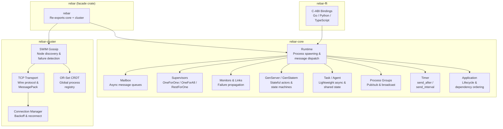

# Rebar

**A BEAM-inspired distributed actor runtime for Rust**

---

## Why Rebar?

Rebar brings Erlang/OTP's battle-tested actor model to Rust. It provides lightweight processes with mailbox messaging, supervision trees for fault tolerance, location-transparent messaging across nodes, SWIM-based clustering for automatic node discovery, and polyglot FFI so you can embed actor systems in Go, Python, and TypeScript applications.

## Feature Highlights

### Core Actor Primitives
- **Lightweight processes** — Spawn thousands of async processes, each with its own mailbox
- **Supervision trees** — OneForOne, OneForAll, and RestForOne restart strategies with configurable thresholds
- **Process monitoring & linking** — Bidirectional failure propagation between related processes
- **GenServer** — Typed stateful server with synchronous calls and async casts
- **GenStatem** — State machine behavior with enter callbacks, timeouts, and event postponement
- **Task** — Lightweight async/await primitives with `async_task`, `yield_result`, `async_map`
- **Agent** — Simple shared state with `get`/`update`/`get_and_update` (no custom messages needed)
- **Timer** — `send_after`, `send_interval`, `apply_after` with cancellation
- **Process Groups** — Named groups with join/leave/broadcast (Erlang `pg` equivalent)
- **Application** — Top-level lifecycle with dependency ordering and environment config
- **PartitionSupervisor** — N identical children partitioned by key hash for load distribution
- **Sys Debug** — Runtime introspection: `get_state`, `suspend`/`resume`, tracing

### Distribution & Networking
- **SWIM gossip protocol** — Automatic node discovery and failure detection across the cluster
- **TCP + QUIC transport** — Efficient binary serialization using MessagePack
- **OR-Set CRDT registry** — Conflict-free global process registry that converges across nodes
- **Connection manager** — Exponential backoff reconnection with jitter
- **Graceful node drain** — Coordinated shutdown with state migration

### Polyglot FFI
- **C-ABI FFI bindings** — Call into the actor runtime from Go, Python, and TypeScript via a stable C interface

### Client Libraries

Idiomatic wrappers for embedding Rebar in Go, Python, and TypeScript applications:

| Language | Package | Actor Pattern |
|----------|---------|--------------|
| Go | `clients/go/` | `Actor` interface with `HandleMessage(ctx, msg)` |
| Python | `clients/python/` | `Actor` ABC with `handle_message(ctx, msg)` |
| TypeScript | `clients/typescript/` | `Actor` abstract class with `handleMessage(ctx, msg)` |

See [Client Libraries](clients/README.md) for build instructions.

See the [documentation](#documentation) for guides, API reference, and architecture deep-dives.

## Architecture Overview



## Quick Start

Add Rebar to your `Cargo.toml`:

```toml
[dependencies]
rebar-core = { path = "rebar-core" }
tokio = { version = "1", features = ["full"] }
rmpv = "1"
```

### Spawn a Process and Send a Message

```rust
use rebar_core::runtime::Runtime;
use std::sync::Arc;

#[tokio::main]
async fn main() {
    let runtime = Arc::new(Runtime::new(1));

    // Spawn a process
    let pid = runtime.spawn(|mut ctx| async move {
        println!("Hello from {:?}", ctx.self_pid());
        while let Some(msg) = ctx.recv().await {
            println!("Got: {:?}", msg.payload());
        }
    }).await;

    // Send a message
    runtime.send(pid, rmpv::Value::from("hello")).await.unwrap();
}
```

### Supervisor Tree

```rust
use rebar_core::supervisor::*;
use rebar_core::runtime::Runtime;
use std::sync::Arc;

let runtime = Arc::new(Runtime::new(1));
let spec = SupervisorSpec::new(RestartStrategy::OneForOne)
    .max_restarts(5)
    .max_seconds(60);
let handle = start_supervisor(runtime.clone(), spec, vec![]).await;
```

### GenServer (Stateful Actor)

```rust
use rebar_core::gen_server::*;
use rebar_core::runtime::Runtime;
use std::sync::Arc;
use std::time::Duration;

struct Counter;

#[async_trait::async_trait]
impl GenServer for Counter {
    type State = u64;
    type Call = String;
    type Cast = String;
    type Reply = u64;

    async fn init(&self, _ctx: &GenServerContext) -> Result<u64, String> { Ok(0) }

    async fn handle_call(&self, msg: String, _from: ProcessId, state: &mut u64, _ctx: &GenServerContext) -> u64 {
        if msg == "get" { *state } else { 0 }
    }

    async fn handle_cast(&self, msg: String, state: &mut u64, _ctx: &GenServerContext) {
        if msg == "inc" { *state += 1; }
    }
}

let rt = Arc::new(Runtime::new(1));
let server = spawn_gen_server(rt, Counter).await;
server.cast("inc".into()).unwrap();
let count = server.call("get".into(), Duration::from_secs(1)).await.unwrap();
assert_eq!(count, 1);
```

### Task (Lightweight Async)

```rust
use rebar_core::task::*;
use rebar_core::runtime::Runtime;

let rt = Runtime::new(1);
let mut task = async_task(&rt, || async { 2 + 2 }).await;
let result = task.await_result(Duration::from_secs(1)).await.unwrap();
assert_eq!(result, 4);
```

### Agent (Simple Shared State)

```rust
use rebar_core::agent::*;
use rebar_core::runtime::Runtime;

let rt = Arc::new(Runtime::new(1));
let agent = start_agent(rt, || vec!["hello".to_string()]).await;

agent.update(|s: &mut Vec<String>| s.push("world".into()), Duration::from_secs(1)).await.unwrap();
let len = agent.get(|s: &Vec<String>| s.len(), Duration::from_secs(1)).await.unwrap();
assert_eq!(len, 2);
```

### Timer

```rust
use rebar_core::runtime::Runtime;

let rt = Runtime::new(1);
rt.spawn(|mut ctx| async move {
    // Send yourself a message in 100ms
    ctx.send_after(rmpv::Value::String("wake up".into()), Duration::from_millis(100));
    let msg = ctx.recv().await.unwrap();
    println!("got: {:?}", msg.payload());
}).await;
```

### Process Groups (Pub/Sub)

```rust
use rebar_core::pg::PgScope;
use rebar_core::process::ProcessId;

let scope = PgScope::new();
let pid1 = ProcessId::new(1, 1);
let pid2 = ProcessId::new(1, 2);

scope.join("notifications", pid1);
scope.join("notifications", pid2);

// Broadcast to all members
let members = scope.get_members("notifications"); // [pid1, pid2]
```

## Benchmark Results

HTTP microservices mesh benchmark (3 services, 2 CPU / 512MB per container):

| Metric | Rebar | Actix | Go | Elixir |
|---|---|---|---|---|
| Throughput (c=100) | 12,332 req/s | 13,175 req/s | 642 req/s | 3,410 req/s |
| Latency P50 | 8.44ms | 9.02ms | 54.98ms | 28.78ms |
| Latency P99 | 16.95ms | 17.71ms | 866ms | 47.28ms |

See [Benchmarks](docs/benchmarks.md) for full methodology and results.

## Documentation

### Getting Started
- [Quick Start](docs/getting-started.md) — progressive examples from first process to distributed messaging

### Guides
- [Building Stateful Services with GenServer](docs/guides/gen-server.md)
- [Parallel Work with Task](docs/guides/tasks.md)
- [Shared State with Agent](docs/guides/agents.md)
- [Delayed and Periodic Messages with Timer](docs/guides/timers.md)
- [Pub/Sub with Process Groups](docs/guides/process-groups.md)
- [State Machines with GenStatem](docs/guides/gen-statem.md)
- [Back-Pressure Pipelines with GenStage](docs/guides/gen-stage.md)
- [Application Lifecycle Management](docs/guides/applications.md)
- [Sharding with PartitionSupervisor](docs/guides/partition-supervisor.md)
- [Extending Rebar](docs/extending.md) — custom transports, dispatchers, registry backends

### Polyglot FFI
- [Go Actors](docs/guides/actors-go.md)
- [Python Actors](docs/guides/actors-python.md)
- [TypeScript Actors](docs/guides/actors-typescript.md)

### API Reference
- [rebar-core](docs/api/rebar-core.md) — processes, supervision, GenServer, GenStatem, Task, Agent, Timer, PG, Sys, GenStage, Application, PartitionSupervisor
- [rebar-cluster](docs/api/rebar-cluster.md) — SWIM gossip, TCP/QUIC transport, CRDT registry, connection management
- [rebar-ffi](docs/api/rebar-ffi.md) — C-ABI bindings for Go, Python, TypeScript

### Architecture & Internals
- [Architecture Overview](docs/architecture.md) — crate structure, process model, message flow
- [Supervisor Engine](docs/internals/supervisor-engine.md)
- [Wire Protocol](docs/internals/wire-protocol.md)
- [SWIM Protocol](docs/internals/swim-protocol.md)
- [CRDT Registry](docs/internals/crdt-registry.md)
- [QUIC Transport](docs/internals/quic-transport.md)
- [Distribution Layer](docs/internals/distribution-layer.md)
- [Node Drain](docs/internals/node-drain.md)

### Performance
- [Benchmarks](docs/benchmarks.md) — HTTP mesh comparison vs Actix, Go, Elixir

## License

MIT
