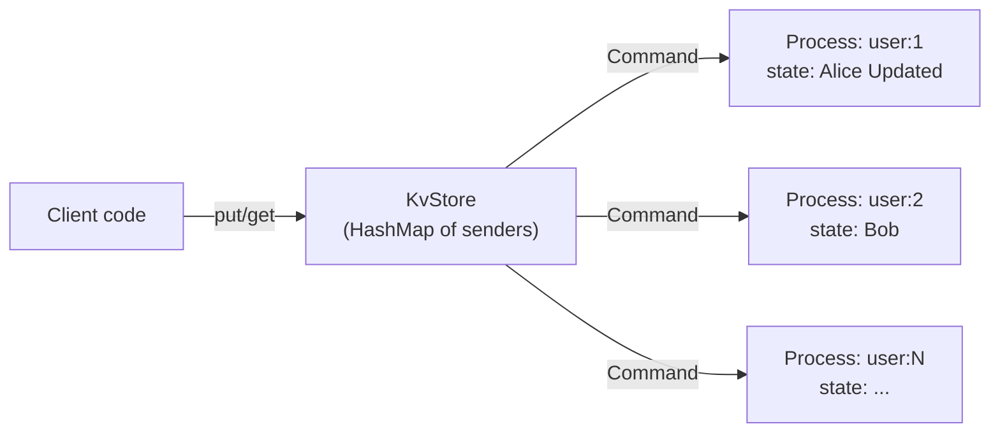

# Getting Started with Rebar

This guide walks you through Rebar's core concepts with progressive, runnable examples. By the end, you will know how to spawn processes, send messages, build request-reply services, supervise process trees, implement process-per-key architectures, and use monitors and links for failure detection.

## Table of Contents

1. [Installation](#1-installation)
2. [Your First Process](#2-your-first-process)
3. [Sending Messages](#3-sending-messages)
4. [Request-Reply Pattern](#4-request-reply-pattern)
5. [Supervisor Trees](#5-supervisor-trees)
6. [Process-per-Key Pattern](#6-process-per-key-pattern)
7. [Monitoring and Linking](#7-monitoring-and-linking)
8. [Distributed Messaging](#8-distributed-messaging)
9. [GenServer (Typed Stateful Actor)](#9-genserver-typed-stateful-actor)
10. [Task (Lightweight Async)](#10-task-lightweight-async)
11. [Agent (Simple Shared State)](#11-agent-simple-shared-state)
12. [Timer (Delayed Messages)](#12-timer-delayed-messages)
13. [Process Groups (Pub/Sub)](#13-process-groups-pubsub)
14. [Sys Debug (Runtime Introspection)](#14-sys-debug-runtime-introspection)
15. [GenStatem (State Machine)](#15-genstatem-state-machine)
16. [GenStage (Back-Pressure Pipeline)](#16-genstage-back-pressure-pipeline)
17. [Application (Lifecycle)](#17-application-lifecycle)
18. [PartitionSupervisor (Sharded Workers)](#18-partitionsupervisor-sharded-workers)

---

## 1. Installation

Create a new Rust project and add the following dependencies to your `Cargo.toml`:

```toml
[dependencies]
rebar-core = { git = "https://github.com/alexandernicholson/rebar" }
tokio = { version = "1", features = ["full"] }
rmpv = "1"
```

Rebar uses [Tokio](https://tokio.rs) as its async runtime and [MessagePack](https://msgpack.org/) (`rmpv::Value`) as its universal message payload format.

---

## 2. Your First Process

A process in Rebar is a lightweight async task with its own mailbox. You create a `Runtime`, then call `spawn` with a closure that receives a `ProcessContext`.

```rust
use rebar_core::runtime::Runtime;

#[tokio::main]
async fn main() {
    // Create a runtime on node 1.
    let rt = Runtime::new(1);

    // Spawn a process. The closure receives a ProcessContext.
    let pid = rt.spawn(|ctx| async move {
        println!("Hello! I am process {}", ctx.self_pid());
    }).await;

    println!("Spawned process with PID: {}", pid);

    // Give the spawned task a moment to print before main exits.
    tokio::time::sleep(std::time::Duration::from_millis(100)).await;
}
```

**Expected output:**

```
Spawned process with PID: <1.1>
Hello! I am process <1.1>
```

Key points:
- `Runtime::new(node_id)` creates a runtime. The `node_id` identifies this node in a cluster.
- `rt.spawn(handler)` returns a `ProcessId` immediately. The handler runs concurrently.
- `ProcessContext::self_pid()` returns the process's own PID.
- PIDs are displayed as `<node_id.local_id>`, similar to Erlang's PID format.

---

## 3. Sending Messages

Processes communicate exclusively by sending messages to each other's mailboxes. Messages carry an `rmpv::Value` payload, a sender PID, and a timestamp.

```rust
use rebar_core::runtime::Runtime;

#[tokio::main]
async fn main() {
    let rt = Runtime::new(1);

    // Spawn a receiver that waits for messages in a loop.
    let receiver_pid = rt.spawn(|mut ctx| async move {
        println!("[receiver {}] Waiting for messages...", ctx.self_pid());

        while let Some(msg) = ctx.recv().await {
            let text = msg.payload().as_str().unwrap_or("(not a string)");
            println!(
                "[receiver] Got '{}' from {}",
                text,
                msg.from()
            );
        }

        println!("[receiver] Mailbox closed, shutting down.");
    }).await;

    // Spawn a sender that sends three messages to the receiver.
    rt.spawn(move |ctx| async move {
        for greeting in &["hello", "world", "goodbye"] {
            ctx.send(receiver_pid, rmpv::Value::from(*greeting))
                .await
                .unwrap();
        }
        println!("[sender {}] All messages sent.", ctx.self_pid());
    }).await;

    // Wait for processing to complete.
    tokio::time::sleep(std::time::Duration::from_millis(200)).await;
}
```

**Expected output:**

```
[receiver <1.1>] Waiting for messages...
[sender <1.2>] All messages sent.
[receiver] Got 'hello' from <1.2>
[receiver] Got 'world' from <1.2>
[receiver] Got 'goodbye' from <1.2>
```

Key points:
- `ctx.recv()` blocks until a message arrives. Returns `None` when the mailbox is closed (all senders dropped).
- `ctx.send(dest, payload)` sends a message to another process. Returns `Err(SendError::ProcessDead(_))` if the target is gone.
- `msg.from()` identifies the sender. `msg.payload()` is the `rmpv::Value`. `msg.timestamp()` is a Unix timestamp in milliseconds.
- You can also send from outside a process using `rt.send(pid, payload)`, which uses a synthetic sender PID of `<node_id.0>`.

---

## 4. Request-Reply Pattern

In Erlang/OTP, a common pattern is sending a request with the caller's PID so the responder can send back a result. Since `rmpv::Value` cannot carry Rust channels, we encode the requester's PID into the message payload and have the responder send the result back to that PID.

This example implements a calculator process that receives `{op, a, b}` requests and sends back the result.

```rust
use rebar_core::runtime::Runtime;
use std::time::Duration;

#[tokio::main]
async fn main() {
    let rt = Runtime::new(1);

    // Spawn a calculator process that processes requests forever.
    let calc_pid = rt.spawn(|mut ctx| async move {
        println!("[calc {}] Ready for requests.", ctx.self_pid());

        while let Some(msg) = ctx.recv().await {
            // Expect a map: {"op": "add"|"mul", "a": int, "b": int, "reply_to_node": int, "reply_to_local": int}
            if let rmpv::Value::Map(entries) = msg.payload().clone() {
                let mut op = String::new();
                let mut a: i64 = 0;
                let mut b: i64 = 0;
                let mut reply_node: u64 = 0;
                let mut reply_local: u64 = 0;

                for (k, v) in &entries {
                    match k.as_str().unwrap_or("") {
                        "op" => op = v.as_str().unwrap_or("").to_string(),
                        "a" => a = v.as_i64().unwrap_or(0),
                        "b" => b = v.as_i64().unwrap_or(0),
                        "reply_to_node" => reply_node = v.as_u64().unwrap_or(0),
                        "reply_to_local" => reply_local = v.as_u64().unwrap_or(0),
                        _ => {}
                    }
                }

                let result = match op.as_str() {
                    "add" => a + b,
                    "mul" => a * b,
                    _ => {
                        println!("[calc] Unknown op: {}", op);
                        continue;
                    }
                };

                let reply_pid = rebar_core::process::ProcessId::new(reply_node, reply_local);
                let _ = ctx.send(reply_pid, rmpv::Value::from(result)).await;
                println!("[calc] {} {} {} = {}", a, op, b, result);
            }
        }
    }).await;

    // Spawn a requester that sends two calculations and waits for replies.
    rt.spawn(move |mut ctx| async move {
        let me = ctx.self_pid();

        // Build a request: 3 + 7
        let request = rmpv::Value::Map(vec![
            (rmpv::Value::from("op"), rmpv::Value::from("add")),
            (rmpv::Value::from("a"), rmpv::Value::from(3)),
            (rmpv::Value::from("b"), rmpv::Value::from(7)),
            (rmpv::Value::from("reply_to_node"), rmpv::Value::from(me.node_id())),
            (rmpv::Value::from("reply_to_local"), rmpv::Value::from(me.local_id())),
        ]);
        ctx.send(calc_pid, request).await.unwrap();

        // Build a request: 5 * 6
        let request = rmpv::Value::Map(vec![
            (rmpv::Value::from("op"), rmpv::Value::from("mul")),
            (rmpv::Value::from("a"), rmpv::Value::from(5)),
            (rmpv::Value::from("b"), rmpv::Value::from(6)),
            (rmpv::Value::from("reply_to_node"), rmpv::Value::from(me.node_id())),
            (rmpv::Value::from("reply_to_local"), rmpv::Value::from(me.local_id())),
        ]);
        ctx.send(calc_pid, request).await.unwrap();

        // Receive the two results.
        for _ in 0..2 {
            if let Some(reply) = ctx.recv_timeout(Duration::from_secs(1)).await {
                println!("[requester] Got result: {}", reply.payload());
            }
        }
    }).await;

    tokio::time::sleep(Duration::from_millis(300)).await;
}
```

**Expected output:**

```
[calc <1.1>] Ready for requests.
[calc] 3 add 7 = 10
[calc] 5 mul 6 = 30
[requester] Got result: 10
[requester] Got result: 30
```

A simpler alternative is to use `msg.from()` directly, since every message already carries the sender's PID:

```rust
// In the calculator, instead of parsing reply_to from the payload:
let reply_pid = msg.from();
let _ = ctx.send(reply_pid, rmpv::Value::from(result)).await;
```

This works well for simple cases. The explicit-PID-in-payload approach is useful when the reply should go to a process other than the sender, or when requests are forwarded through intermediaries.

---

## 5. Supervisor Trees

Supervisors monitor child processes and restart them according to a strategy when they fail. This is the core of Rebar's fault tolerance, directly inspired by OTP supervisors.

```rust
use rebar_core::process::ExitReason;
use rebar_core::runtime::Runtime;
use rebar_core::supervisor::{
    ChildEntry, ChildSpec, RestartStrategy, RestartType, SupervisorSpec,
    start_supervisor,
};
use std::sync::atomic::{AtomicU32, Ordering};
use std::sync::Arc;
use std::time::Duration;

#[tokio::main]
async fn main() {
    let rt = Arc::new(Runtime::new(1));

    // Track how many times the worker has started.
    let start_count = Arc::new(AtomicU32::new(0));

    // Create a child entry with a factory closure.
    // The factory is called each time the child needs to be (re)started.
    let counter = Arc::clone(&start_count);
    let entry = ChildEntry::new(
        ChildSpec::new("flaky-worker")
            .restart(RestartType::Permanent),  // Always restart
        move || {
            let counter = Arc::clone(&counter);
            async move {
                let n = counter.fetch_add(1, Ordering::SeqCst) + 1;
                println!("[worker] Start #{}", n);

                if n <= 3 {
                    // Simulate a crash on the first 3 starts.
                    println!("[worker] Crashing! (start #{})", n);
                    ExitReason::Abnormal(format!("crash #{}", n))
                } else {
                    // Fourth start: stay alive and do real work.
                    println!("[worker] Running normally (start #{})", n);
                    tokio::time::sleep(Duration::from_secs(60)).await;
                    ExitReason::Normal
                }
            }
        },
    );

    // Configure the supervisor: OneForOne strategy, max 5 restarts in 60 seconds.
    let spec = SupervisorSpec::new(RestartStrategy::OneForOne)
        .max_restarts(5)
        .max_seconds(60);

    // Start the supervisor with our child.
    let handle = start_supervisor(rt.clone(), spec, vec![entry]).await;
    println!("Supervisor started at PID: {}", handle.pid());

    // Wait and observe the restarts.
    tokio::time::sleep(Duration::from_secs(2)).await;

    let total_starts = start_count.load(Ordering::SeqCst);
    println!("Worker started {} times (3 crashes + 1 successful)", total_starts);

    // Clean shutdown.
    handle.shutdown();
    tokio::time::sleep(Duration::from_millis(100)).await;
}
```

**Expected output:**

```
Supervisor started at PID: <1.1>
[worker] Start #1
[worker] Crashing! (start #1)
[worker] Start #2
[worker] Crashing! (start #2)
[worker] Start #3
[worker] Crashing! (start #3)
[worker] Start #4
[worker] Running normally (start #4)
Worker started 4 times (3 crashes + 1 successful)
```

### Restart Strategies

| Strategy | Behavior |
|---|---|
| `OneForOne` | Only the crashed child is restarted |
| `OneForAll` | All children are stopped and restarted when one crashes |
| `RestForOne` | The crashed child and all children started after it are restarted |

### Restart Types

| Type | Behavior |
|---|---|
| `Permanent` | Always restart, regardless of exit reason |
| `Transient` | Only restart on abnormal exit (not `ExitReason::Normal`) |
| `Temporary` | Never restart |

### Dynamic Children

You can add children to a running supervisor:

```rust
let new_entry = ChildEntry::new(
    ChildSpec::new("dynamic-worker"),
    || async {
        println!("[dynamic] I was added at runtime!");
        tokio::time::sleep(std::time::Duration::from_secs(60)).await;
        ExitReason::Normal
    },
);

let child_pid = handle.add_child(new_entry).await.unwrap();
println!("Added dynamic child: {}", child_pid);
```

---

## 6. Process-per-Key Pattern

A powerful pattern is to dedicate one long-lived process per logical key (user, session, device, etc.). Each process owns its state exclusively, eliminating contention. This is the same pattern used in Rebar's benchmark store service.

```rust
use rebar_core::runtime::Runtime;
use std::collections::HashMap;
use std::sync::Arc;
use tokio::sync::{mpsc, oneshot, Mutex};

/// Commands that a key-process handles.
enum Command {
    Get { reply: oneshot::Sender<Option<String>> },
    Put { value: String, reply: oneshot::Sender<()> },
}

/// A simple key-value store backed by one process per key.
struct KvStore {
    runtime: Arc<Runtime>,
    keys: Arc<Mutex<HashMap<String, mpsc::Sender<Command>>>>,
}

impl KvStore {
    fn new(runtime: Arc<Runtime>) -> Self {
        Self {
            runtime,
            keys: Arc::new(Mutex::new(HashMap::new())),
        }
    }

    /// Get or create a dedicated process for the given key.
    async fn get_key_sender(&self, key: &str) -> mpsc::Sender<Command> {
        let mut keys = self.keys.lock().await;
        if let Some(tx) = keys.get(key) {
            return tx.clone();
        }

        // Create a channel for commands to this key's process.
        let (cmd_tx, mut cmd_rx) = mpsc::channel::<Command>(64);

        // Spawn a process that owns the state for this key.
        self.runtime.spawn(move |_ctx| async move {
            let mut value: Option<String> = None;

            while let Some(cmd) = cmd_rx.recv().await {
                match cmd {
                    Command::Get { reply } => {
                        let _ = reply.send(value.clone());
                    }
                    Command::Put { value: v, reply } => {
                        value = Some(v);
                        let _ = reply.send(());
                    }
                }
            }
        }).await;

        keys.insert(key.to_string(), cmd_tx.clone());
        cmd_tx
    }

    /// Get the value for a key.
    async fn get(&self, key: &str) -> Option<String> {
        let sender = self.get_key_sender(key).await;
        let (reply_tx, reply_rx) = oneshot::channel();
        let _ = sender.send(Command::Get { reply: reply_tx }).await;
        reply_rx.await.ok().flatten()
    }

    /// Set the value for a key.
    async fn put(&self, key: &str, value: String) {
        let sender = self.get_key_sender(key).await;
        let (reply_tx, reply_rx) = oneshot::channel();
        let _ = sender.send(Command::Put { value, reply: reply_tx }).await;
        let _ = reply_rx.await;
    }
}

#[tokio::main]
async fn main() {
    let runtime = Arc::new(Runtime::new(1));
    let store = KvStore::new(runtime);

    // Write some keys - each key gets its own dedicated process.
    store.put("user:1", "Alice".to_string()).await;
    store.put("user:2", "Bob".to_string()).await;
    store.put("user:1", "Alice Updated".to_string()).await;

    // Read them back.
    println!("user:1 = {:?}", store.get("user:1").await);
    println!("user:2 = {:?}", store.get("user:2").await);
    println!("user:3 = {:?}", store.get("user:3").await);
}
```

**Expected output:**

```
user:1 = Some("Alice Updated")
user:2 = Some("Bob")
user:3 = None
```

The architecture looks like this:



Key advantages of this pattern:
- **No locks on hot data** -- each key's state lives in exactly one process, so reads and writes never contend.
- **Independent failure** -- if a key-process panics, only that key is affected.
- **Natural backpressure** -- the bounded `mpsc::channel` limits how many commands can queue per key.

---

## 7. Monitoring and Linking

Rebar provides two primitives for tracking process health: **monitors** and **links**. They serve different purposes.

### MonitorSet: One-Way Notifications

A monitor is a one-directional observation. When you monitor a process, you get notified when it exits, but the monitored process is unaffected by your exit.

```rust
use rebar_core::process::monitor::MonitorSet;
use rebar_core::process::ProcessId;

fn main() {
    let mut monitors = MonitorSet::new();

    // Monitor two processes.
    let worker_a = ProcessId::new(1, 10);
    let worker_b = ProcessId::new(1, 20);

    let ref_a = monitors.add_monitor(worker_a);
    let ref_b = monitors.add_monitor(worker_b);

    // You can monitor the same target multiple times (each gets a unique ref).
    let ref_a2 = monitors.add_monitor(worker_a);

    // Query who is watching a target.
    println!("Monitors on worker_a: {}",
        monitors.monitors_for(worker_a).count());  // 2
    println!("Monitors on worker_b: {}",
        monitors.monitors_for(worker_b).count());  // 1

    // Remove a specific monitor.
    monitors.remove_monitor(ref_a);
    println!("After removing ref_a, monitors on worker_a: {}",
        monitors.monitors_for(worker_a).count());  // 1

    // Remove remaining monitors.
    monitors.remove_monitor(ref_a2);
    monitors.remove_monitor(ref_b);
    println!("After cleanup, monitors on worker_a: {}",
        monitors.monitors_for(worker_a).count());  // 0
}
```

**Expected output:**

```
Monitors on worker_a: 2
Monitors on worker_b: 1
After removing ref_a, monitors on worker_a: 1
After cleanup, monitors on worker_a: 0
```

### LinkSet: Bidirectional Failure Propagation

Links create a bidirectional relationship: if either linked process dies abnormally, the other is also terminated. This is how Erlang's process linking works.

```rust
use rebar_core::process::monitor::LinkSet;
use rebar_core::process::ProcessId;

fn main() {
    let mut links = LinkSet::new();

    let worker = ProcessId::new(1, 10);
    let supervisor = ProcessId::new(1, 20);
    let logger = ProcessId::new(1, 30);

    // Establish links.
    links.add_link(worker);
    links.add_link(supervisor);

    // Check link status.
    println!("Linked to worker? {}", links.is_linked(worker));       // true
    println!("Linked to supervisor? {}", links.is_linked(supervisor)); // true
    println!("Linked to logger? {}", links.is_linked(logger));       // false

    // Adding a duplicate link is idempotent.
    links.add_link(worker);
    println!("Linked PIDs count: {}", links.linked_pids().count());  // 2

    // Remove a link.
    links.remove_link(worker);
    println!("Linked to worker after removal? {}", links.is_linked(worker)); // false

    // Iterate over remaining linked PIDs.
    for pid in links.linked_pids() {
        println!("Still linked to: {}", pid);
    }
}
```

**Expected output:**

```
Linked to worker? true
Linked to supervisor? true
Linked to logger? false
Linked PIDs count: 2
Linked to worker after removal? false
Still linked to: <1.20>
```

### Detecting Process Death in Practice

While the full monitor-to-runtime integration is being wired up, you can detect process death by observing `SendError::ProcessDead` when sending to a terminated process:

```rust
use rebar_core::runtime::Runtime;
use std::time::Duration;

#[tokio::main]
async fn main() {
    let rt = Runtime::new(1);

    // Spawn a short-lived process that exits immediately.
    let target = rt.spawn(|_ctx| async move {
        println!("[target] Starting and exiting immediately.");
    }).await;

    // Spawn a watcher that polls the target.
    let (detected_tx, detected_rx) = tokio::sync::oneshot::channel::<bool>();

    rt.spawn(move |ctx| async move {
        // Give the target a moment to exit.
        tokio::time::sleep(Duration::from_millis(50)).await;

        // Try to send - if the process is dead, we get an error.
        match ctx.send(target, rmpv::Value::Nil).await {
            Ok(()) => {
                println!("[watcher] Target is still alive.");
                let _ = detected_tx.send(false);
            }
            Err(e) => {
                println!("[watcher] Target is dead: {}", e);
                let _ = detected_tx.send(true);
            }
        }
    }).await;

    let is_dead = tokio::time::timeout(Duration::from_secs(2), detected_rx)
        .await
        .unwrap()
        .unwrap();

    println!("Detected target death: {}", is_dead);
}
```

**Expected output:**

```
[target] Starting and exiting immediately.
[watcher] Target is dead: process dead: <1.1>
Detected target death: true
```

### Monitors vs Links: When to Use Which

| Aspect | Monitor | Link |
|---|---|---|
| Direction | One-way (observer is notified) | Bidirectional (both processes affected) |
| Effect on observer | Receives notification only | Terminated if linked process dies abnormally |
| Multiplicity | Can add multiple monitors to same target | Idempotent (only one link per pair) |
| Use case | Health checking, dashboards, logging | Coupled processes that should fail together |
| Erlang equivalent | `erlang:monitor/2` | `erlang:link/1` |

In OTP style, supervisors use monitors to watch children (so the supervisor can restart them without being killed itself), while worker processes that depend on each other use links (so they fail together and let the supervisor handle the restart).

---

## 8. Distributed Messaging

Rebar supports transparent message passing across nodes. When you use a `DistributedRuntime`, `ctx.send()` automatically routes to remote nodes when the target PID belongs to a different node.

### Setting Up Two Connected Nodes

```rust
use rebar::DistributedRuntime;
use rebar_cluster::connection::manager::ConnectionManager;
use rebar_cluster::transport::tcp::{TcpTransport, TcpTransportConnector};
use rebar_cluster::transport::TransportListener;
use std::sync::Arc;

#[tokio::main]
async fn main() {
    // --- Node 1 (listener) ---
    let connector1 = TcpTransportConnector;
    let mgr1 = ConnectionManager::new(Box::new(connector1));
    let mut node1 = DistributedRuntime::new(1, mgr1);

    // Start a TCP listener
    let transport = TcpTransport;
    let listener = transport.listen("127.0.0.1:0".parse().unwrap()).await.unwrap();
    let node1_addr = listener.local_addr();

    // Spawn a receiver on node 1
    let (done_tx, done_rx) = tokio::sync::oneshot::channel();
    let receiver_pid = node1.runtime().spawn(move |mut ctx| async move {
        let msg = ctx.recv().await.unwrap();
        done_tx.send(msg.payload().as_str().unwrap().to_string()).unwrap();
    }).await;

    // --- Node 2 (connector) ---
    let connector2 = TcpTransportConnector;
    let mgr2 = ConnectionManager::new(Box::new(connector2));
    let mut node2 = DistributedRuntime::new(2, mgr2);

    // Connect node 2 to node 1
    node2.connection_manager_mut().connect(1, node1_addr).await.unwrap();

    // Spawn a sender on node 2 that sends to the receiver on node 1
    let _ = node2.runtime().spawn(move |ctx| async move {
        ctx.send(receiver_pid, rmpv::Value::String("hello from node 2".into()))
            .await
            .unwrap();
    }).await;

    // Process the outbound message on node 2
    node2.process_outbound().await;

    // Accept the connection on node 1 and deliver the inbound frame
    let mut conn = listener.accept().await.unwrap();
    use rebar_cluster::transport::TransportConnection;
    let frame = conn.recv().await.unwrap();
    node1.deliver_inbound(&frame).unwrap();

    // Verify delivery
    let result = done_rx.await.unwrap();
    assert_eq!(result, "hello from node 2");
    println!("Cross-node message delivered: {result}");
}
```

Key points:
- **`DistributedRuntime::new(node_id, connection_manager)`** wires a `DistributedRouter` that routes by node ID
- **`ctx.send()`** is transparent -- same API whether local or remote
- **`process_outbound()`** flushes the RouterCommand channel to the ConnectionManager
- **`deliver_inbound()`** delivers received frames to local mailboxes

---

## 9. GenServer (Typed Stateful Actor)

A `GenServer` is a typed, stateful actor -- the Rebar equivalent of Erlang/OTP's `gen_server`. You define associated types for your state, call/cast messages, and reply, then implement a trait. The framework handles the mailbox loop, call timeouts, and process cleanup.

```rust
use rebar_core::gen_server::{spawn_gen_server, GenServer, GenServerContext};
use rebar_core::process::ProcessId;
use rebar_core::runtime::Runtime;
use std::sync::Arc;
use std::time::Duration;

/// A simple counter GenServer.
struct Counter;

#[async_trait::async_trait]
impl GenServer for Counter {
    type State = u64;
    type Call = String;
    type Cast = String;
    type Reply = u64;

    async fn init(&self, _ctx: &GenServerContext) -> Result<Self::State, String> {
        Ok(0)
    }

    async fn handle_call(
        &self,
        msg: Self::Call,
        _from: ProcessId,
        state: &mut Self::State,
        _ctx: &GenServerContext,
    ) -> Self::Reply {
        match msg.as_str() {
            "get" => *state,
            "increment_and_get" => {
                *state += 1;
                *state
            }
            _ => 0,
        }
    }

    async fn handle_cast(
        &self,
        msg: Self::Cast,
        state: &mut Self::State,
        _ctx: &GenServerContext,
    ) {
        if msg == "increment" {
            *state += 1;
        }
    }
}

#[tokio::main]
async fn main() {
    let rt = Arc::new(Runtime::new(1));

    // Spawn the GenServer -- returns a typed handle.
    let server = spawn_gen_server(Arc::clone(&rt), Counter).await;
    println!("Counter started at PID: {}", server.pid());

    // Cast (fire-and-forget): increment three times.
    for _ in 0..3 {
        server.cast("increment".to_string()).unwrap();
    }

    // Give casts a moment to process.
    tokio::time::sleep(Duration::from_millis(50)).await;

    // Call (synchronous): read the current count.
    let count = server
        .call("get".to_string(), Duration::from_secs(1))
        .await
        .unwrap();
    println!("Count after 3 increments: {}", count);

    // Call: increment and get atomically.
    let count = server
        .call("increment_and_get".to_string(), Duration::from_secs(1))
        .await
        .unwrap();
    println!("Count after increment_and_get: {}", count);
}
```

**Expected output:**

```
Counter started at PID: <1.1>
Count after 3 increments: 3
Count after increment_and_get: 4
```

Key points:
- **`GenServer` trait** -- associated types (`State`, `Call`, `Cast`, `Reply`) define the message protocol at compile time.
- **`spawn_gen_server(runtime, impl)`** -- spawns the server and returns a typed `GenServerRef<S>`.
- **`call(msg, timeout)`** -- synchronous request that blocks until the server replies or the timeout expires.
- **`cast(msg)`** -- asynchronous fire-and-forget message. Returns immediately.
- **`handle_continue`** -- implement this callback and use `ctx.continue_with(payload)` in `init` or other callbacks to defer expensive initialization work without blocking callers.

---

## 10. Task (Lightweight Async)

Tasks are lightweight one-shot async computations that run as processes. Use them when you need to run work concurrently and optionally collect the result. Rebar provides `async_task` for awaitable tasks, `start_task` for fire-and-forget, and `async_map` for bounded parallel processing.

```rust
use rebar_core::runtime::Runtime;
use rebar_core::task::{async_task, start_task, async_map, StreamOpts};
use std::sync::Arc;
use std::time::Duration;

#[tokio::main]
async fn main() {
    let rt = Arc::new(Runtime::new(1));

    // --- async_task + await_result: spawn and wait for a result ---
    let mut task = async_task(&rt, || async {
        tokio::time::sleep(Duration::from_millis(10)).await;
        42_u64
    })
    .await;

    let result = task.await_result(Duration::from_secs(1)).await.unwrap();
    println!("Task result: {}", result);

    // --- yield_result: non-blocking check ---
    let mut slow_task = async_task(&rt, || async {
        tokio::time::sleep(Duration::from_secs(60)).await;
        99_u64
    })
    .await;

    match slow_task.yield_result(Duration::from_millis(10)).await {
        Some(Ok(val)) => println!("Got value: {}", val),
        Some(Err(e)) => println!("Task failed: {}", e),
        None => println!("Task still running (yield returned None)"),
    }

    // --- start_task: fire-and-forget ---
    let pid = start_task(&rt, || async {
        println!("Fire-and-forget task executed!");
    })
    .await;
    println!("Started fire-and-forget task at PID: {}", pid);

    // --- async_map: bounded parallel processing ---
    let results = async_map(
        Arc::clone(&rt),
        vec![1_u64, 2, 3, 4, 5],
        |x| async move { x * x },
        StreamOpts {
            max_concurrency: 3,
            ordered: true,
            timeout: Duration::from_secs(5),
        },
    )
    .await;

    let squares: Vec<u64> = results.into_iter().map(|r| r.unwrap()).collect();
    println!("Squares: {:?}", squares);

    // Give fire-and-forget task time to print.
    tokio::time::sleep(Duration::from_millis(50)).await;
}
```

**Expected output:**

```
Task result: 42
Task still running (yield returned None)
Started fire-and-forget task at PID: <1.3>
Fire-and-forget task executed!
Squares: [1, 4, 9, 16, 25]
```

Key points:
- **`async_task(runtime, closure)`** -- spawns a task as a process and returns a `Task<T>` handle with `await_result()` and `yield_result()`.
- **`yield_result(timeout)`** -- returns `None` if the task is still running, without consuming the result receiver. Can be called repeatedly.
- **`start_task(runtime, closure)`** -- fire-and-forget. Returns the PID but no result handle.
- **`async_map(runtime, items, f, opts)`** -- processes a collection concurrently with bounded parallelism (`max_concurrency`). Returns results in input order when `ordered: true`.
- Tasks are full processes with PIDs, so they appear in the process table and are cleaned up on completion.

---

## 11. Agent (Simple Shared State)

An `Agent` is the simplest way to manage shared state in Rebar. Unlike `GenServer`, you do not need to define custom message types -- you pass closures directly. This is Rebar's equivalent of Elixir's `Agent` module.

```rust
use rebar_core::agent::start_agent;
use rebar_core::runtime::Runtime;
use std::collections::HashMap;
use std::sync::Arc;
use std::time::Duration;

#[tokio::main]
async fn main() {
    let rt = Arc::new(Runtime::new(1));

    // Start an agent with a HashMap as its state.
    let agent = start_agent(Arc::clone(&rt), HashMap::<String, u64>::new).await;
    println!("Agent started at PID: {}", agent.pid());

    // Update: insert some entries.
    agent
        .update(
            |state: &mut HashMap<String, u64>| {
                state.insert("apples".to_string(), 5);
                state.insert("oranges".to_string(), 3);
            },
            Duration::from_secs(1),
        )
        .await
        .unwrap();

    // Get: read a value.
    let apples = agent
        .get(
            |state: &HashMap<String, u64>| state.get("apples").copied().unwrap_or(0),
            Duration::from_secs(1),
        )
        .await
        .unwrap();
    println!("Apples: {}", apples);

    // Get and update: atomically read the old value and modify state.
    let old_oranges = agent
        .get_and_update(
            |state: &mut HashMap<String, u64>| {
                let old = state.get("oranges").copied().unwrap_or(0);
                state.insert("oranges".to_string(), old + 10);
                old
            },
            Duration::from_secs(1),
        )
        .await
        .unwrap();
    println!("Oranges before update: {}", old_oranges);

    let new_oranges = agent
        .get(
            |state: &HashMap<String, u64>| state.get("oranges").copied().unwrap_or(0),
            Duration::from_secs(1),
        )
        .await
        .unwrap();
    println!("Oranges after update: {}", new_oranges);

    // Cast: fire-and-forget update.
    agent
        .cast(|state: &mut HashMap<String, u64>| {
            state.insert("bananas".to_string(), 7);
        })
        .unwrap();

    tokio::time::sleep(Duration::from_millis(20)).await;

    let bananas = agent
        .get(
            |state: &HashMap<String, u64>| state.get("bananas").copied().unwrap_or(0),
            Duration::from_secs(1),
        )
        .await
        .unwrap();
    println!("Bananas: {}", bananas);
}
```

**Expected output:**

```
Agent started at PID: <1.1>
Apples: 5
Oranges before update: 3
Oranges after update: 13
Bananas: 7
```

Key points:
- **No custom message types** -- `get`, `update`, `get_and_update`, and `cast` all take closures. The Agent handles serialization internally.
- **`get(f, timeout)`** -- reads state without modifying it. The closure receives `&S`.
- **`update(f, timeout)`** -- modifies state. The closure receives `&mut S`. Waits for confirmation.
- **`get_and_update(f, timeout)`** -- atomically reads and modifies. The closure receives `&mut S` and returns a value.
- **`cast(f)`** -- fire-and-forget state mutation. Returns immediately without waiting.
- Use `Agent` for simple state management. Switch to `GenServer` when you need typed messages, `handle_info`, or the `continue` pattern.

---

## 12. Timer (Delayed Messages)

Timers let you send messages to processes after a delay or at regular intervals. They integrate with the message router, so messages arrive in the target's standard mailbox. Timers return a `TimerRef` that can be cancelled.

```rust
use rebar_core::gen_server::{spawn_gen_server, GenServer, GenServerContext};
use rebar_core::process::{Message, ProcessId};
use rebar_core::runtime::Runtime;
use std::sync::Arc;
use std::time::Duration;

/// A server that uses timers to send itself delayed messages.
struct TimerDemo;

#[async_trait::async_trait]
impl GenServer for TimerDemo {
    type State = Vec<String>;
    type Call = String;
    type Cast = ();
    type Reply = Vec<String>;

    async fn init(&self, ctx: &GenServerContext) -> Result<Self::State, String> {
        // Schedule a message to ourselves after 50ms.
        ctx.send_after_self(
            rmpv::Value::String("delayed_hello".into()),
            Duration::from_millis(50),
        );

        // Schedule a periodic tick every 30ms.
        let _tick_ref = ctx.send_interval(
            ctx.self_pid(),
            rmpv::Value::String("tick".into()),
            Duration::from_millis(30),
        );

        Ok(Vec::new())
    }

    async fn handle_call(
        &self,
        _msg: Self::Call,
        _from: ProcessId,
        state: &mut Self::State,
        _ctx: &GenServerContext,
    ) -> Self::Reply {
        state.clone()
    }

    async fn handle_cast(
        &self,
        _msg: Self::Cast,
        _state: &mut Self::State,
        _ctx: &GenServerContext,
    ) {}

    async fn handle_info(
        &self,
        msg: Message,
        state: &mut Self::State,
        _ctx: &GenServerContext,
    ) {
        if let Some(text) = msg.payload().as_str() {
            state.push(text.to_string());
        }
    }
}

#[tokio::main]
async fn main() {
    let rt = Arc::new(Runtime::new(1));

    let server = spawn_gen_server(Arc::clone(&rt), TimerDemo).await;
    println!("TimerDemo started at PID: {}", server.pid());

    // Wait for timers to fire.
    tokio::time::sleep(Duration::from_millis(150)).await;

    // Read the collected messages.
    let events = server
        .call("get".to_string(), Duration::from_secs(1))
        .await
        .unwrap();

    println!("Received {} timer events:", events.len());
    for event in &events {
        println!("  - {}", event);
    }

    // Demonstrate cancel: schedule a timer then cancel it.
    use rebar_core::timer;
    let timer_ref = timer::apply_after(Duration::from_millis(100), || async {
        println!("This should NOT print (timer was cancelled).");
    });
    timer_ref.cancel();
    println!("Timer cancelled. is_finished: {}", timer_ref.is_finished());
}
```

**Expected output:**

```
TimerDemo started at PID: <1.1>
Received 5 timer events:
  - tick
  - delayed_hello
  - tick
  - tick
  - tick
Timer cancelled. is_finished: true
```

Key points:
- **`ctx.send_after_self(payload, delay)`** -- sends a message to the current process after a delay. The message arrives in `handle_info`.
- **`ctx.send_interval(dest, payload, interval)`** -- sends a message repeatedly at the given interval. The first message arrives after one interval (not immediately).
- **`timer::apply_after(delay, f)`** -- executes a closure after a delay, outside of any process context.
- **`TimerRef::cancel()`** -- cancels a pending timer. Idempotent (safe to call multiple times).
- **`TimerRef::is_finished()`** -- returns `true` if the timer has fired or been cancelled.

---

## 13. Process Groups (Pub/Sub)

Process groups provide a pub/sub mechanism where processes can join named groups and receive broadcast messages. This is Rebar's equivalent of Erlang's `pg` module. Groups are organized into scopes for namespace isolation.

```rust
use rebar_core::pg::PgScope;
use rebar_core::process::ProcessId;
use rebar_core::process::table::{ProcessHandle, ProcessTable};
use rebar_core::process::mailbox::Mailbox;
use rebar_core::router::LocalRouter;
use std::sync::Arc;

fn main() {
    // Set up a process table and router so we can demonstrate broadcast.
    let table = Arc::new(ProcessTable::new(1));
    let router = LocalRouter::new(Arc::clone(&table));

    // Create mailboxes for three worker processes.
    let worker1 = table.allocate_pid();
    let worker2 = table.allocate_pid();
    let worker3 = table.allocate_pid();

    let (tx1, mut rx1) = Mailbox::unbounded();
    let (tx2, mut rx2) = Mailbox::unbounded();
    let (tx3, mut rx3) = Mailbox::unbounded();

    table.insert(worker1, ProcessHandle::new(tx1));
    table.insert(worker2, ProcessHandle::new(tx2));
    table.insert(worker3, ProcessHandle::new(tx3));

    // Create a process group scope.
    let scope = PgScope::new();

    // Workers join the "notifications" group.
    scope.join("notifications", worker1);
    scope.join("notifications", worker2);

    // Worker 3 joins a different group.
    scope.join("logging", worker3);

    println!("notification members: {:?}", scope.get_members("notifications"));
    println!("logging members: {:?}", scope.get_members("logging"));
    println!("all groups: {:?}", scope.which_groups());

    // Broadcast a message to the "notifications" group.
    let sender = ProcessId::new(1, 0);
    let results = scope.broadcast(
        "notifications",
        sender,
        &rmpv::Value::String("alert: server restarted".into()),
        &router,
    );
    println!("Broadcast sent to {} members", results.len());

    // Verify workers received the broadcast.
    let msg1 = rx1.try_recv().unwrap();
    let msg2 = rx2.try_recv().unwrap();
    println!("Worker 1 got: {}", msg1.payload().as_str().unwrap());
    println!("Worker 2 got: {}", msg2.payload().as_str().unwrap());

    // Worker 3 should NOT have received anything (different group).
    assert!(rx3.try_recv().is_err());
    println!("Worker 3 (logging group): no message (correct)");

    // Clean up: remove a process from all groups.
    scope.remove_pid(worker1);
    println!(
        "After removing worker1, notification members: {:?}",
        scope.get_members("notifications")
    );
}
```

**Expected output:**

```
notification members: [<1.1>, <1.2>]
logging members: [<1.3>]
all groups: ["logging", "notifications"]
Broadcast sent to 2 members
Worker 1 got: alert: server restarted
Worker 2 got: alert: server restarted
Worker 3 (logging group): no message (correct)
After removing worker1, notification members: [<1.2>]
```

Key points:
- **`PgScope::new()`** -- creates a new scope. Use multiple scopes to partition group namespaces.
- **`scope.join(group, pid)`** -- adds a process to a named group. A process can join the same group multiple times.
- **`scope.get_members(group)`** -- returns all PIDs in a group.
- **`scope.broadcast(group, from, payload, router)`** -- sends a message to every member of the group.
- **`scope.remove_pid(pid)`** -- removes a process from all groups it belongs to. Call this on process death.
- Groups are local to the scope. For cross-node groups, use `scope.get_local_members(group, node_id)` to filter by node.

---

## 14. Sys Debug (Runtime Introspection)

The sys debug interface lets you inspect and control running `GenServer` processes without stopping them. You can read server state, suspend message processing, and resume it -- all through the `GenServerRef` handle.

```rust
use rebar_core::gen_server::{spawn_gen_server, GenServer, GenServerContext};
use rebar_core::process::ProcessId;
use rebar_core::runtime::Runtime;
use std::sync::Arc;
use std::time::Duration;

struct Counter;

#[async_trait::async_trait]
impl GenServer for Counter {
    type State = u64;
    type Call = String;
    type Cast = String;
    type Reply = u64;

    async fn init(&self, _ctx: &GenServerContext) -> Result<Self::State, String> {
        Ok(0)
    }

    async fn handle_call(
        &self,
        _msg: Self::Call,
        _from: ProcessId,
        state: &mut Self::State,
        _ctx: &GenServerContext,
    ) -> Self::Reply {
        *state
    }

    async fn handle_cast(
        &self,
        msg: Self::Cast,
        state: &mut Self::State,
        _ctx: &GenServerContext,
    ) {
        if msg == "inc" {
            *state += 1;
        }
    }
}

#[tokio::main]
async fn main() {
    let rt = Arc::new(Runtime::new(1));
    let server = spawn_gen_server(Arc::clone(&rt), Counter).await;

    // Increment a few times.
    for _ in 0..5 {
        server.cast("inc".to_string()).unwrap();
    }
    tokio::time::sleep(Duration::from_millis(50)).await;

    // Inspect state without stopping the server.
    let state = server.sys_get_state(Duration::from_secs(1)).await.unwrap();
    println!("Current state (via sys_get_state): {}", state);

    // Suspend the server -- it stops processing calls/casts/info.
    server.sys_suspend(Duration::from_secs(1)).await.unwrap();
    println!("Server suspended.");

    // Casts sent while suspended will queue but not be processed.
    server.cast("inc".to_string()).unwrap();
    tokio::time::sleep(Duration::from_millis(50)).await;

    // State should still be 5 because the server is suspended.
    let state = server.sys_get_state(Duration::from_secs(1)).await.unwrap();
    println!("State while suspended: {}", state);

    // Resume the server.
    server.sys_resume(Duration::from_secs(1)).await.unwrap();
    println!("Server resumed.");

    // Give the queued cast time to process.
    tokio::time::sleep(Duration::from_millis(50)).await;

    let state = server.sys_get_state(Duration::from_secs(1)).await.unwrap();
    println!("State after resume: {}", state);
}
```

**Expected output:**

```
Current state (via sys_get_state): 5
Server suspended.
State while suspended: 5
Server resumed.
State after resume: 6
```

Key points:
- **`sys_get_state(timeout)`** -- reads the current server state without modifying it. Requires `State: Clone`.
- **`sys_suspend(timeout)`** -- pauses processing of calls, casts, and info messages. Sys commands continue to work while suspended.
- **`sys_resume(timeout)`** -- resumes a suspended server. Queued messages are processed in order.
- These operations are equivalent to Erlang's `:sys.get_state/2`, `:sys.suspend/2`, and `:sys.resume/2`.
- Suspension is useful for debugging, hot-code-reload preparation, or temporarily pausing a server under load.

---

## 15. GenStatem (State Machine)

A `GenStatem` is a typed finite state machine, equivalent to Erlang/OTP's `gen_statem`. States are typically represented as an enum, and transitions can set state timeouts that automatically fire events after a delay.

This example implements a traffic light that cycles Green -> Yellow -> Red -> Green using state timeouts.

```rust
use rebar_core::gen_statem::{
    spawn_gen_statem, Action, CallbackMode, EventType, GenStatem, TransitionResult,
};
use rebar_core::process::ExitReason;
use rebar_core::runtime::Runtime;
use std::sync::atomic::{AtomicU32, Ordering};
use std::sync::Arc;
use std::time::Duration;

#[derive(Debug, Clone, PartialEq)]
enum Light {
    Green,
    Yellow,
    Red,
}

struct TrafficLight {
    transitions: Arc<AtomicU32>,
}

#[async_trait::async_trait]
impl GenStatem for TrafficLight {
    type State = Light;
    type Data = ();
    type Call = String;
    type Cast = ();
    type Reply = String;

    fn callback_mode(&self) -> (CallbackMode, bool) {
        (CallbackMode::HandleEventFunction, false)
    }

    async fn init(&self) -> Result<(Self::State, Self::Data), String> {
        Ok((Light::Green, ()))
    }

    async fn handle_event(
        &self,
        event_type: EventType<Self::Reply>,
        _event: rmpv::Value,
        state: &Self::State,
        data: &mut Self::Data,
    ) -> TransitionResult<Self::State, Self::Data, Self::Reply> {
        match event_type {
            EventType::Call(reply_tx) => {
                let color = format!("{:?}", state);
                TransitionResult::KeepStateAndData {
                    actions: vec![Action::Reply(reply_tx, color)],
                }
            }

            EventType::StateTimeout => {
                self.transitions.fetch_add(1, Ordering::SeqCst);
                let (next_state, timeout_ms) = match state {
                    Light::Green => (Light::Yellow, 50),
                    Light::Yellow => (Light::Red, 50),
                    Light::Red => (Light::Green, 50),
                };
                println!("{:?} -> {:?}", state, next_state);
                TransitionResult::NextState {
                    state: next_state,
                    data: *data,
                    actions: vec![Action::StateTimeout(
                        Duration::from_millis(timeout_ms),
                        rmpv::Value::Nil,
                    )],
                }
            }

            // Start the cycle on any cast.
            EventType::Cast => TransitionResult::KeepStateAndData {
                actions: vec![Action::StateTimeout(
                    Duration::from_millis(50),
                    rmpv::Value::Nil,
                )],
            },

            _ => TransitionResult::KeepStateAndData { actions: vec![] },
        }
    }
}

#[tokio::main]
async fn main() {
    let rt = Arc::new(Runtime::new(1));
    let transitions = Arc::new(AtomicU32::new(0));

    let light = spawn_gen_statem(
        Arc::clone(&rt),
        TrafficLight {
            transitions: Arc::clone(&transitions),
        },
    )
    .await;

    println!("Traffic light started at PID: {}", light.pid());

    // Query current state.
    let color = light.call("status".to_string(), Duration::from_secs(1)).await.unwrap();
    println!("Initial state: {}", color);

    // Kick off the cycle with a cast.
    light.cast(()).unwrap();

    // Let it cycle a few times.
    tokio::time::sleep(Duration::from_millis(400)).await;

    let total = transitions.load(Ordering::SeqCst);
    println!("Total transitions: {}", total);
}
```

**Expected output:**

```
Traffic light started at PID: <1.1>
Initial state: Green
Green -> Yellow
Yellow -> Red
Red -> Green
Green -> Yellow
Yellow -> Red
Red -> Green
Total transitions: 6
```

Key points:
- **`GenStatem` trait** -- associated types define `State` (enum), `Data` (mutable context), `Call`, `Cast`, and `Reply`.
- **`callback_mode()`** -- returns `HandleEventFunction` (all events go through a single `handle_event` callback). The second element enables state-enter callbacks.
- **`TransitionResult::NextState`** -- transitions to a new state with optional actions.
- **`Action::StateTimeout(duration, payload)`** -- sets a timeout that fires `EventType::StateTimeout` if no state change occurs before it expires. The timeout is automatically cancelled on state change.
- **`Action::Reply(tx, value)`** -- sends a reply to a caller within `handle_event` (since the reply channel is passed via `EventType::Call`).
- State machines also support `EventTimeout` (cancelled on any external event), `GenericTimeout` (named, independent), and `Postpone` (re-queue on state change).

---

## 16. GenStage (Back-Pressure Pipeline)

A `GenStage` implements a back-pressure-aware producer/consumer pipeline, inspired by Elixir's GenStage. Producers generate events on demand, consumers process them, and the framework manages flow control automatically.

```rust
use rebar_core::gen_stage::{
    spawn_stage, GenStage, GenStageRef, StageType, SubscribeOpts,
};
use rebar_core::runtime::Runtime;
use std::sync::atomic::{AtomicU64, Ordering};
use std::sync::Arc;
use std::time::Duration;

/// A producer that generates sequential numbers on demand.
struct NumberProducer {
    counter: Arc<AtomicU64>,
}

#[async_trait::async_trait]
impl GenStage for NumberProducer {
    type State = ();

    async fn init(&self) -> Result<(StageType, Self::State), String> {
        Ok((StageType::Producer, ()))
    }

    async fn handle_demand(
        &self,
        demand: usize,
        _state: &mut Self::State,
    ) -> Vec<rmpv::Value> {
        let mut events = Vec::with_capacity(demand);
        for _ in 0..demand {
            let n = self.counter.fetch_add(1, Ordering::SeqCst);
            events.push(rmpv::Value::Integer(rmpv::Integer::from(n)));
        }
        events
    }
}

/// A consumer that counts how many events it has processed.
struct NumberConsumer {
    processed: Arc<AtomicU64>,
}

#[async_trait::async_trait]
impl GenStage for NumberConsumer {
    type State = ();

    async fn init(&self) -> Result<(StageType, Self::State), String> {
        Ok((StageType::Consumer, ()))
    }

    async fn handle_events(
        &self,
        events: Vec<rmpv::Value>,
        _from: rebar_core::gen_stage::SubscriptionTag,
        _state: &mut Self::State,
    ) -> Vec<rmpv::Value> {
        self.processed
            .fetch_add(events.len() as u64, Ordering::SeqCst);
        vec![] // Consumers don't emit events downstream.
    }
}

#[tokio::main]
async fn main() {
    let rt = Arc::new(Runtime::new(1));

    let counter = Arc::new(AtomicU64::new(1));
    let processed = Arc::new(AtomicU64::new(0));

    // Spawn the producer and consumer stages.
    let producer = spawn_stage(
        Arc::clone(&rt),
        NumberProducer {
            counter: Arc::clone(&counter),
        },
    )
    .await;
    println!("Producer started at PID: {}", producer.pid());

    let consumer = spawn_stage(
        Arc::clone(&rt),
        NumberConsumer {
            processed: Arc::clone(&processed),
        },
    )
    .await;
    println!("Consumer started at PID: {}", consumer.pid());

    // Subscribe the consumer to the producer.
    // The consumer will automatically request demand.
    let _tag = consumer
        .subscribe(
            &producer,
            SubscribeOpts::new(10, 5), // max_demand=10, min_demand=5
        )
        .await
        .unwrap();
    println!("Consumer subscribed to producer.");

    // Let the pipeline run and process events.
    tokio::time::sleep(Duration::from_millis(200)).await;

    let total = processed.load(Ordering::SeqCst);
    println!("Consumer processed {} events", total);
    assert!(total > 0, "consumer should have processed events");
}
```

**Expected output:**

```
Producer started at PID: <1.1>
Consumer started at PID: <1.2>
Consumer subscribed to producer.
Consumer processed 10 events
```

Key points:
- **`GenStage` trait** -- implement `init()` to declare the stage type (`Producer`, `Consumer`, or `ProducerConsumer`).
- **`handle_demand(demand, state)`** -- called on producers when a consumer requests events. Return up to `demand` events.
- **`handle_events(events, from, state)`** -- called on consumers with a batch of events from upstream.
- **`consumer.subscribe(&producer, opts)`** -- establishes a subscription. The consumer automatically sends initial demand based on `max_demand`.
- **`SubscribeOpts::new(max_demand, min_demand)`** -- `max_demand` is the initial batch size; `min_demand` is the threshold at which the consumer re-requests events.
- Back-pressure is automatic: producers only generate events when consumers ask for them. Events that cannot be dispatched are buffered internally.

---

## 17. Application (Lifecycle)

An `Application` is the top-level entry point for a Rebar system. It starts a supervision tree and manages its lifecycle. The `ApplicationManager` handles dependency ordering -- `ensure_all_started` performs a topological sort and starts dependencies first.

```rust
use rebar_core::application::{AppEnv, AppSpec, Application, ApplicationManager};
use rebar_core::process::ExitReason;
use rebar_core::runtime::Runtime;
use rebar_core::supervisor::{
    ChildEntry, ChildSpec, RestartStrategy, SupervisorSpec, start_supervisor,
    SupervisorHandle,
};
use std::sync::Arc;
use std::time::Duration;

/// A database application that starts a worker.
struct DatabaseApp;

#[async_trait::async_trait]
impl Application for DatabaseApp {
    async fn start(
        &self,
        runtime: Arc<Runtime>,
        env: &AppEnv,
    ) -> Result<SupervisorHandle, rebar_core::application::AppError> {
        let db_url = env
            .get_or("db_url", rmpv::Value::String("localhost:5432".into()));
        println!(
            "[database] Starting with url: {}",
            db_url.as_str().unwrap_or("unknown")
        );

        let spec = SupervisorSpec::new(RestartStrategy::OneForOne);
        let entry = ChildEntry::new(ChildSpec::new("db-worker"), || async {
            println!("[database] Worker running.");
            tokio::time::sleep(Duration::from_secs(60)).await;
            ExitReason::Normal
        });

        Ok(start_supervisor(runtime, spec, vec![entry]).await)
    }

    async fn prep_stop(&self, _env: &AppEnv) {
        println!("[database] Preparing to stop...");
    }

    async fn stop(&self, _env: &AppEnv) {
        println!("[database] Stopped.");
    }
}

/// A web application that depends on the database.
struct WebApp;

#[async_trait::async_trait]
impl Application for WebApp {
    async fn start(
        &self,
        runtime: Arc<Runtime>,
        env: &AppEnv,
    ) -> Result<SupervisorHandle, rebar_core::application::AppError> {
        let port = env
            .get_or("port", rmpv::Value::Integer(8080.into()));
        println!(
            "[web] Starting on port: {}",
            port.as_u64().unwrap_or(0)
        );

        let spec = SupervisorSpec::new(RestartStrategy::OneForOne);
        Ok(start_supervisor(runtime, spec, vec![]).await)
    }
}

#[tokio::main]
async fn main() {
    let rt = Arc::new(Runtime::new(1));
    let mgr = ApplicationManager::new(Arc::clone(&rt));

    // Register applications with specs.
    mgr.register(
        AppSpec::new("database")
            .env_val("db_url", rmpv::Value::String("postgres://prod:5432".into())),
        DatabaseApp,
    );

    mgr.register(
        AppSpec::new("web")
            .dependency("database")
            .env_val("port", rmpv::Value::Integer(3000.into())),
        WebApp,
    );

    // Start "web" and all its dependencies in topological order.
    let started = mgr.ensure_all_started("web").await.unwrap();
    println!("Started applications: {:?}", started);

    tokio::time::sleep(Duration::from_millis(100)).await;

    println!("Running: {:?}", mgr.started_applications());

    // Read environment at runtime.
    let db_env = mgr.env("database").unwrap();
    println!("Database URL: {}", db_env.get("db_url").unwrap().as_str().unwrap());

    // Orderly shutdown in reverse start order.
    mgr.stop_all().await.unwrap();
    tokio::time::sleep(Duration::from_millis(50)).await;
    println!("All applications stopped.");
}
```

**Expected output:**

```
[database] Starting with url: postgres://prod:5432
[database] Worker running.
[web] Starting on port: 3000
Started applications: ["database", "web"]
Running: ["database", "web"]
Database URL: postgres://prod:5432
[database] Preparing to stop...
[database] Stopped.
All applications stopped.
```

Key points:
- **`Application` trait** -- implement `start(runtime, env)` to return a `SupervisorHandle`. Optional `prep_stop` and `stop` callbacks run during shutdown.
- **`AppSpec::new(name)`** -- declares the application name, dependencies, and initial environment values.
- **`AppSpec::dependency(name)`** -- declares that another application must be started first.
- **`AppEnv`** -- thread-safe key-value store for configuration. Pre-populated from `AppSpec::env_val` entries.
- **`ApplicationManager::ensure_all_started(name)`** -- resolves transitive dependencies, topologically sorts them, and starts each in order. Already-running applications are skipped.
- **`stop_all()`** -- stops all running applications in reverse start order, calling `prep_stop` and `stop` callbacks.

---

## 18. PartitionSupervisor (Sharded Workers)

A `PartitionSupervisor` starts N identical worker processes and routes work to them by key. This is useful for sharding load across independent processes while maintaining deterministic routing. Equivalent to Elixir's `PartitionSupervisor`.

```rust
use rebar_core::partition_supervisor::{
    start_partition_supervisor, PartitionSupervisorSpec,
};
use rebar_core::process::ExitReason;
use rebar_core::runtime::Runtime;
use std::sync::Arc;
use std::time::Duration;

#[tokio::main]
async fn main() {
    let rt = Arc::new(Runtime::new(1));

    // Start a PartitionSupervisor with 4 partitions.
    let handle = start_partition_supervisor(
        Arc::clone(&rt),
        PartitionSupervisorSpec::new().partitions(4),
        Arc::new(|partition_index| {
            Box::pin(async move {
                println!("[partition {}] Started.", partition_index);
                // Each partition stays alive, processing work.
                tokio::time::sleep(Duration::from_secs(60)).await;
                ExitReason::Normal
            })
        }),
    )
    .await;

    // Give partitions time to start.
    tokio::time::sleep(Duration::from_millis(100)).await;

    println!("PartitionSupervisor started with {} partitions", handle.partitions());

    // Route by integer key: key % partitions.
    let pid_for_user_42 = handle.which_partition(42);
    let pid_for_user_43 = handle.which_partition(43);
    println!("User 42 -> partition PID: {}", pid_for_user_42);
    println!("User 43 -> partition PID: {}", pid_for_user_43);

    // Same key always routes to the same partition.
    assert_eq!(handle.which_partition(42), pid_for_user_42);

    // Route by hashable key (strings, structs, etc.).
    let pid_a = handle.which_partition_by_hash(&"session:abc");
    let pid_b = handle.which_partition_by_hash(&"session:xyz");
    println!("session:abc -> {}", pid_a);
    println!("session:xyz -> {}", pid_b);

    // Access a specific partition by index.
    for i in 0..handle.partitions() {
        let pid = handle.partition_pid(i).unwrap();
        println!("Partition {} -> PID: {}", i, pid);
    }

    // Clean shutdown.
    handle.shutdown();
    tokio::time::sleep(Duration::from_millis(50)).await;
    println!("PartitionSupervisor shut down.");
}
```

**Expected output:**

```
[partition 0] Started.
[partition 1] Started.
[partition 2] Started.
[partition 3] Started.
PartitionSupervisor started with 4 partitions
User 42 -> partition PID: <1.4>
User 43 -> partition PID: <1.5>
session:abc -> <1.3>
session:xyz -> <1.4>
Partition 0 -> PID: <1.3>
Partition 1 -> PID: <1.4>
Partition 2 -> PID: <1.5>
Partition 3 -> PID: <1.6>
PartitionSupervisor shut down.
```

Key points:
- **`PartitionSupervisorSpec::new().partitions(n)`** -- configures the number of partitions. Defaults to the number of CPU cores.
- **`start_partition_supervisor(runtime, spec, factory)`** -- the factory receives a zero-based partition index and returns a future. It is called once per partition at startup and again on restarts.
- **`which_partition(key: u64)`** -- routes an integer key to a partition using `key % partitions`. Deterministic and consistent.
- **`which_partition_by_hash(key)`** -- routes any `Hash` type by hashing the key first. Use this for string keys, composite keys, etc.
- **`partition_pid(index)`** -- returns the PID of a specific partition by its zero-based index.
- Partitions are supervised: if one crashes, only that partition is restarted (OneForOne by default). Other partitions continue unaffected.

---

## Next Steps

- Read the [Architecture Guide](architecture.md) for a deeper understanding of Rebar's internals.
- See the [Extending Rebar](extending.md) guide for building custom supervision patterns, transports, and registry backends.
- Explore the OTP-style abstractions: [GenServer](#9-genserver-typed-stateful-actor) for typed actors, [GenStatem](#15-genstatem-state-machine) for state machines, [GenStage](#16-genstage-back-pressure-pipeline) for data pipelines, and [Application](#17-application-lifecycle) for lifecycle management.
- Use [Agent](#11-agent-simple-shared-state) for quick shared state, [Task](#10-task-lightweight-async) for one-off async work, and [PartitionSupervisor](#18-partitionsupervisor-sharded-workers) for sharded workloads.
- Check the API Reference: [rebar-core](api/rebar-core.md) | [rebar-cluster](api/rebar-cluster.md) | [rebar-ffi](api/rebar-ffi.md) for complete type documentation.
- Explore the internals: [Supervisor Engine](internals/supervisor-engine.md) | [Wire Protocol](internals/wire-protocol.md) | [SWIM Protocol](internals/swim-protocol.md) | [CRDT Registry](internals/crdt-registry.md).
- Deep dives: [QUIC Transport](internals/quic-transport.md) | [Distribution Layer](internals/distribution-layer.md) | [Node Drain](internals/node-drain.md).
- Client libraries: [Go](clients/go/README.md) | [Python](clients/python/README.md) | [TypeScript](clients/typescript/README.md) for using Rebar from other languages.
- Run the [benchmarks](benchmarks.md) to see Rebar's performance characteristics.
