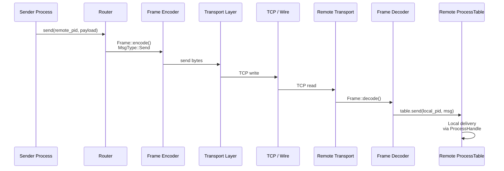
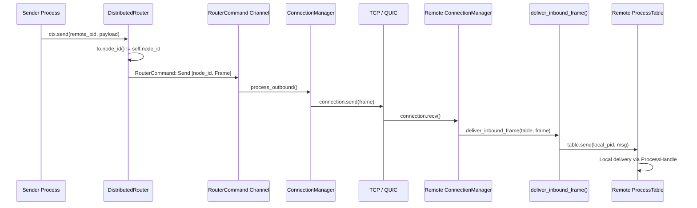
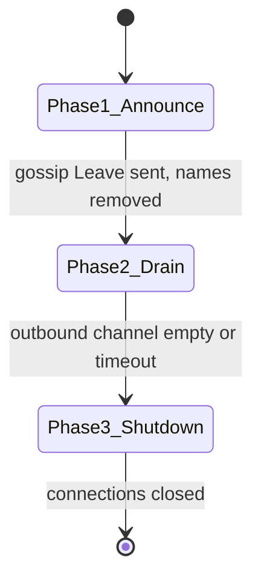
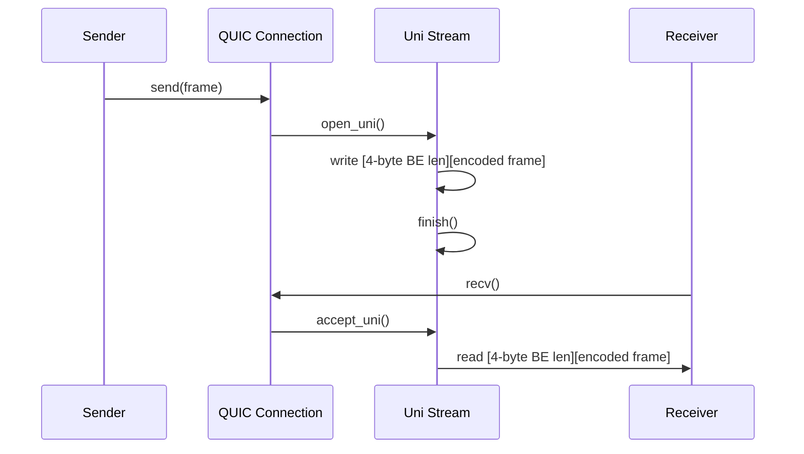
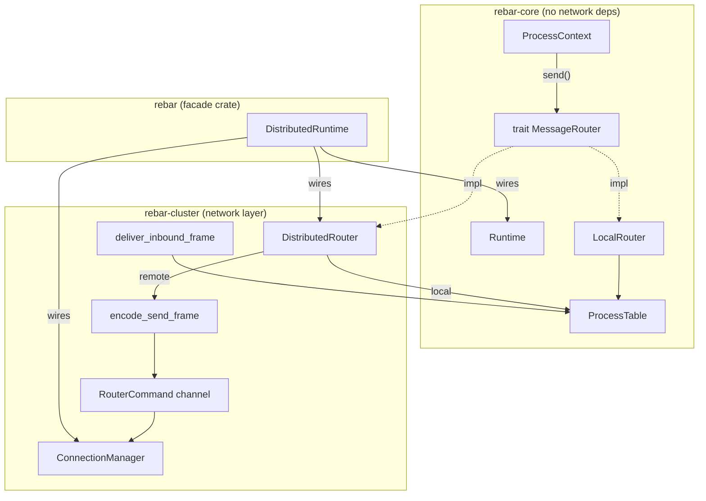
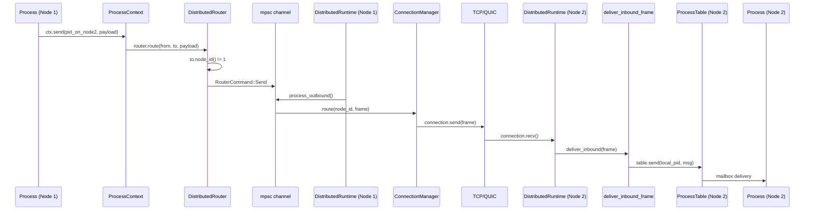
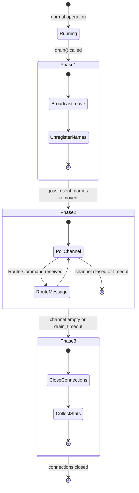
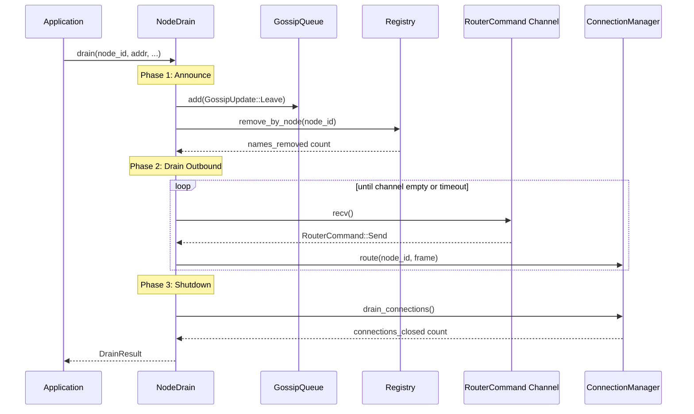

# Documentation Update Implementation Plan

> **For Claude:** REQUIRED SUB-SKILL: Use superpowers:executing-plans to implement this plan task-by-task.

**Goal:** Update 6 existing doc files and create 3 new internals docs to cover QUIC transport, distribution layer, and graceful node drain.

**Architecture:** Surgical updates to existing files following the established doc pattern (architecture.md = overview, api/*.md = type/method reference, internals/*.md = deep dive). New internals files mirror the structure of swim-protocol.md.

**Tech Stack:** Markdown, Mermaid diagrams, Rust code examples drawn from actual implementations.

---

### Task 1: Update architecture.md — Remote Messaging section

**Files:**
- Modify: `docs/architecture.md:123-144`

**Step 1: Replace "(Planned)" remote messaging with actual implementation**

Replace lines 123-144 in `docs/architecture.md`. The current content is a conceptual "Remote Messaging (Planned)" section with a placeholder sequence diagram. Replace with the actual implementation details.

Find the existing block:

```markdown
### Remote Messaging (Planned)


```

Replace with:

```markdown
### Remote Messaging

When a process sends to a PID on a different node, the `MessageRouter` trait intercepts the call and routes it over the network. The `DistributedRouter` (from `rebar-cluster`) implements this trait: it delivers locally when `to.node_id() == self.node_id`, otherwise encodes the message as a `Frame` and sends a `RouterCommand::Send` to the transport layer via an mpsc channel.

On the receiving node, `deliver_inbound_frame()` extracts addressing from the frame header and delivers the payload to the target process's mailbox.



Key types:
- **`MessageRouter`** trait (rebar-core) — `route(from, to, payload) -> Result<(), SendError>`
- **`LocalRouter`** — default, wraps ProcessTable for single-node use
- **`DistributedRouter`** — local + remote routing via RouterCommand channel
- **`DistributedRuntime`** (rebar facade) — wires core Runtime with cluster ConnectionManager

See [Distribution Layer Internals](internals/distribution-layer.md) for the full deep dive.
```

**Step 2: Verify no Mermaid syntax issues**

Run: `grep -n '<br>' docs/architecture.md | head -20`
Expected: No `<br>` in state diagram transition labels or sequence diagram messages

**Step 3: Commit**

```bash
git add docs/architecture.md
git commit -m "docs: replace planned remote messaging with actual implementation"
```

---

### Task 2: Update architecture.md — Add QUIC Transport and Drain subsections

**Files:**
- Modify: `docs/architecture.md` (insert after the Transport and Connection Management section, around line 461)

**Step 1: Find the end of the Transport and Connection Management section**

Look for the `---` separator after the connection lifecycle sequence diagram (around line 461). Insert the following two new subsections before the next `---`.

**Step 2: Add QUIC Transport subsection**

Insert after the existing transport/connection section ends:

```markdown
### QUIC Transport

Rebar includes a QUIC transport implementation (`rebar-cluster::transport::quic`) built on [quinn](https://docs.rs/quinn) 0.11. Key design decisions:

- **Stream-per-frame model.** Each `send()` opens a new unidirectional QUIC stream, writes a 4-byte big-endian length prefix followed by the encoded frame, then finishes the stream. Each `recv()` accepts a unidirectional stream and reads the length-prefixed frame. This avoids head-of-line blocking between independent messages.
- **Self-signed certificates.** `generate_self_signed_cert()` uses [rcgen](https://docs.rs/rcgen) to produce a DER certificate, PKCS8 private key, and SHA-256 fingerprint (`CertHash = [u8; 32]`).
- **Fingerprint verification.** `FingerprintVerifier` implements `rustls::client::danger::ServerCertVerifier` to verify the remote certificate's SHA-256 hash matches the expected value. No CA trust chain is needed.
- **SWIM integration.** The `cert_hash` field on `Member` and `GossipUpdate::Alive` allows nodes to exchange certificate fingerprints via gossip, enabling automatic QUIC connection establishment.

See [QUIC Transport Internals](internals/quic-transport.md) for implementation details.

### Graceful Node Drain

The drain protocol (`rebar-cluster::drain`) provides orderly node shutdown in three phases:



| Phase | Action | Timeout (default) |
|-------|--------|-------------------|
| 1. Announce | Broadcast `GossipUpdate::Leave`, unregister all names from registry | 5s |
| 2. Drain Outbound | Process remaining `RouterCommand`s from channel | 30s |
| 3. Shutdown | Close all connections via `ConnectionManager::drain_connections()` | 10s |

`DrainResult` provides observability: `processes_stopped`, `messages_drained`, `phase_durations`, and `timed_out`.

See [Node Drain Internals](internals/node-drain.md) for the full protocol specification.
```

**Step 3: Commit**

```bash
git add docs/architecture.md
git commit -m "docs: add QUIC transport and graceful drain sections to architecture"
```

---

### Task 3: Update architecture.md — SWIM cert_hash mention

**Files:**
- Modify: `docs/architecture.md:271-303` (SWIM section)

**Step 1: Find the SWIM protocol overview section**

Around line 271-303 there is a SWIM overview. Find the paragraph that describes membership tracking.

**Step 2: Add cert_hash mention**

After the existing SWIM overview text, add a note about cert_hash. Find the paragraph ending with the state machine diagram (around line 303) and add after it:

```markdown
The `Member` struct also carries an optional `cert_hash: Option<[u8; 32]>` field — the SHA-256 fingerprint of the node's TLS certificate. When present, this enables automatic QUIC transport connections: a node receiving an `Alive` gossip with a `cert_hash` can connect to the advertised address and verify the certificate fingerprint without a CA.
```

**Step 3: Commit**

```bash
git add docs/architecture.md
git commit -m "docs: mention cert_hash in SWIM section of architecture"
```

---

### Task 4: Update api/rebar-core.md — Add router module

**Files:**
- Modify: `docs/api/rebar-core.md` (insert new section before the `runtime` module at line 462)

**Step 1: Insert router module section**

Insert the following before line 462 (`## Module: `runtime``):

```markdown
## Module: `router`

Message routing abstraction. The `MessageRouter` trait decouples how messages are delivered from the process runtime, allowing transparent local or distributed routing.

---

### `MessageRouter` (trait)

Trait for routing messages between processes. Implementations decide whether to deliver locally or over the network.

**Definition:**

```rust
pub trait MessageRouter: Send + Sync {
    fn route(
        &self,
        from: ProcessId,
        to: ProcessId,
        payload: rmpv::Value,
    ) -> Result<(), SendError>;
}
```

**Bounds:** `Send + Sync` — routers are shared across async tasks via `Arc<dyn MessageRouter>`.

---

### `LocalRouter`

Default router that delivers messages to the local `ProcessTable`. This is the router used by `Runtime::new()`.

**Definition:**

```rust
pub struct LocalRouter {
    table: Arc<ProcessTable>,
}
```

**Methods:**

- `new(table: Arc<ProcessTable>) -> Self` — Create a local router backed by the given process table.

**Implements:** `MessageRouter` — calls `table.send(to, Message::new(from, payload))`.

**Example:**

```rust
use std::sync::Arc;
use rebar_core::process::table::ProcessTable;
use rebar_core::router::{LocalRouter, MessageRouter};
use rebar_core::process::ProcessId;

let table = Arc::new(ProcessTable::new(1));
let router = LocalRouter::new(Arc::clone(&table));

let from = ProcessId::new(1, 0);
let to = ProcessId::new(1, 1);
// Routes locally through the ProcessTable
router.route(from, to, rmpv::Value::String("hello".into()));
```

---
```

**Step 2: Update Runtime struct definition**

Find the Runtime definition at line 474-478 and replace with:

```rust
pub struct Runtime {
    node_id: u64,
    table: Arc<ProcessTable>,
    router: Arc<dyn MessageRouter>,
}
```

**Step 3: Update Runtime methods list**

Find the methods list at line 483 and add after `new`:

- `with_router(node_id: u64, table: Arc<ProcessTable>, router: Arc<dyn MessageRouter>) -> Self` — Create a runtime with a custom message router. Used by `DistributedRuntime` to inject a `DistributedRouter`.
- `table(&self) -> &Arc<ProcessTable>` — Return a reference to the runtime's process table.

**Step 4: Update ProcessContext definition**

Find the ProcessContext definition at line 526-530 and replace with:

```rust
pub struct ProcessContext {
    pid: ProcessId,
    rx: MailboxRx,
    router: Arc<dyn MessageRouter>,
}
```

**Step 5: Update ProcessContext send description**

Find the `send` method description at line 538. Update to note it delegates to the router:

- `async send(&self, dest: ProcessId, payload: rmpv::Value) -> Result<(), SendError>` — Send a message to another process. Delegates to the runtime's `MessageRouter`, which may deliver locally or route to a remote node.

**Step 6: Commit**

```bash
git add docs/api/rebar-core.md
git commit -m "docs: add router module and update Runtime/ProcessContext for router"
```

---

### Task 5: Update api/rebar-cluster.md — Add router module

**Files:**
- Modify: `docs/api/rebar-cluster.md` (insert new section after the transport section, around line 357)

**Step 1: Insert router module section**

Insert the following after line 357 (after the `TcpConnection` section, before `## swim`):

```markdown
## Module: `router`

Distributed message routing. Extends `rebar-core::MessageRouter` with remote delivery via the transport layer.

---

### `RouterCommand`

Commands sent to the remote transport layer for cross-node delivery.

**Definition:**

```rust
#[derive(Debug)]
pub enum RouterCommand {
    Send { node_id: u64, frame: Frame },
}
```

The `Send` variant carries the target node ID and the encoded `Frame` to transmit.

---

### `DistributedRouter`

A distributed message router that delivers messages locally when the target is on this node, or encodes them as frames and forwards to the remote transport layer via an mpsc channel.

**Definition:**

```rust
pub struct DistributedRouter {
    node_id: u64,
    table: Arc<ProcessTable>,
    remote_tx: mpsc::Sender<RouterCommand>,
}
```

**Methods:**

- `new(node_id: u64, table: Arc<ProcessTable>, remote_tx: mpsc::Sender<RouterCommand>) -> Self` — Create a distributed router for the given node.

**Implements:** `MessageRouter`
- If `to.node_id() == self.node_id`: delivers locally via `table.send()`
- Otherwise: encodes as `Frame` via `encode_send_frame()` and sends `RouterCommand::Send` to the channel
- Returns `Err(SendError::NodeUnreachable(node_id))` if the channel is full

---

### `encode_send_frame`

Encode a send message into a wire protocol frame.

```rust
pub fn encode_send_frame(
    from: ProcessId,
    to: ProcessId,
    payload: rmpv::Value,
) -> Frame
```

Returns a `Frame` with `MsgType::Send`, version 1, and a header map containing `from_node`, `from_local`, `to_node`, `to_local` fields.

---

### `deliver_inbound_frame`

Deliver an inbound frame from the network to a local process.

```rust
pub fn deliver_inbound_frame(
    table: &ProcessTable,
    frame: &Frame,
) -> Result<(), SendError>
```

Extracts `from_node`, `from_local`, `to_node`, `to_local` from the frame header map, constructs a `Message`, and delivers it to the target process via `table.send()`.

---
```

**Step 2: Commit**

```bash
git add docs/api/rebar-cluster.md
git commit -m "docs: add router module to rebar-cluster API reference"
```

---

### Task 6: Update api/rebar-cluster.md — Add drain module

**Files:**
- Modify: `docs/api/rebar-cluster.md` (insert after the router section added in Task 5)

**Step 1: Insert drain module section**

Insert after the router section:

```markdown
## Module: `drain`

Graceful node drain protocol. Orchestrates three-phase shutdown: announce departure, drain in-flight messages, close connections.

---

### `DrainConfig`

Configuration for the three-phase drain protocol.

**Definition:**

```rust
#[derive(Debug, Clone)]
pub struct DrainConfig {
    /// Time to propagate Leave gossip (phase 1).
    pub announce_timeout: Duration,
    /// Time to wait for in-flight messages (phase 2).
    pub drain_timeout: Duration,
    /// Time for supervisor shutdown (phase 3).
    pub shutdown_timeout: Duration,
}
```

**Defaults:** `announce_timeout: 5s`, `drain_timeout: 30s`, `shutdown_timeout: 10s`

---

### `DrainResult`

Result of a completed drain operation.

**Definition:**

```rust
#[derive(Debug)]
pub struct DrainResult {
    pub processes_stopped: usize,
    pub messages_drained: usize,
    pub phase_durations: [Duration; 3],
    pub timed_out: bool,
}
```

| Field | Description |
|-------|-------------|
| `processes_stopped` | Number of processes stopped during shutdown |
| `messages_drained` | Number of outbound messages processed during phase 2 |
| `phase_durations` | Duration of each phase: `[announce, drain, shutdown]` |
| `timed_out` | Whether any phase hit its timeout |

---

### `NodeDrain`

Orchestrates the three-phase drain protocol.

**Methods:**

| Method | Signature | Description |
|--------|-----------|-------------|
| `new` | `fn new(config: DrainConfig) -> Self` | Create a drain orchestrator with the given config |
| `announce` | `fn announce(&self, node_id, addr, gossip, registry) -> usize` | Phase 1: broadcast Leave gossip, unregister names. Returns names removed count. |
| `drain_outbound` | `async fn drain_outbound(&self, remote_rx, connection_manager) -> (usize, bool)` | Phase 2: drain RouterCommand channel. Returns (count, timed_out). |
| `drain` | `async fn drain(&self, node_id, addr, gossip, registry, remote_rx, connection_manager, process_count) -> DrainResult` | Execute the full three-phase drain protocol. |

**Example:**

```rust
use rebar_cluster::drain::{NodeDrain, DrainConfig};

let drain = NodeDrain::new(DrainConfig::default());

// Phase 1 only
let names_removed = drain.announce(node_id, addr, &mut gossip, &mut registry);

// Full drain
let result = drain.drain(
    node_id, addr, &mut gossip, &mut registry,
    &mut remote_rx, &mut connection_manager, process_count,
).await;

println!("Drained {} messages in {:?}", result.messages_drained, result.phase_durations);
```

---
```

**Step 2: Commit**

```bash
git add docs/api/rebar-cluster.md
git commit -m "docs: add drain module to rebar-cluster API reference"
```

---

### Task 7: Update api/rebar-cluster.md — Add QUIC transport + update SWIM + update connection

**Files:**
- Modify: `docs/api/rebar-cluster.md` (multiple locations)

**Step 1: Add QUIC transport subsection**

Find the transport section (ends around line 356 with `TcpConnection`). Insert after the `TcpConnection` section:

```markdown
### CertHash

SHA-256 fingerprint of a DER-encoded certificate.

```rust
pub type CertHash = [u8; 32];
```

---

### `generate_self_signed_cert`

```rust
pub fn generate_self_signed_cert() -> (CertificateDer<'static>, PrivateKeyDer<'static>, CertHash)
```

Generate a self-signed certificate using rcgen with subject "rebar-node". Returns the DER-encoded certificate, its PKCS8 private key, and the SHA-256 fingerprint.

---

### `cert_fingerprint`

```rust
pub fn cert_fingerprint(cert: &CertificateDer<'_>) -> CertHash
```

Compute the SHA-256 fingerprint of a DER-encoded certificate.

---

### `QuicTransport`

QUIC transport using stream-per-frame with length-prefixed framing. Built on quinn 0.11.

**Definition:**

```rust
pub struct QuicTransport {
    cert: CertificateDer<'static>,
    key: PrivateKeyDer<'static>,
}
```

**Methods:**

| Method | Signature | Description |
|--------|-----------|-------------|
| `new` | `fn new(cert, key) -> Self` | Create a QUIC transport with the given credentials |
| `listen` | `async fn listen(&self, addr: SocketAddr) -> Result<QuicListener, TransportError>` | Bind a QUIC server endpoint |
| `connect` | `async fn connect(&self, addr, expected_cert_hash) -> Result<QuicConnection, TransportError>` | Connect to a remote endpoint, verifying certificate fingerprint |

---

### `QuicListener`

QUIC server endpoint. **Implements:** `TransportListener<Connection = QuicConnection>`

---

### `QuicConnection`

A single QUIC connection. **Implements:** `TransportConnection`

Each `send()` opens a new unidirectional stream, writes `[4-byte BE length][encoded frame]`, then finishes the stream. Each `recv()` accepts a unidirectional stream and reads the length-prefixed frame.

---

### `QuicTransportConnector`

A `TransportConnector` implementation backed by QUIC. Each `connect()` creates a fresh `QuicTransport` with cloned credentials and verifies the remote certificate fingerprint.

**Definition:**

```rust
pub struct QuicTransportConnector {
    cert: CertificateDer<'static>,
    key: PrivateKeyDer<'static>,
    expected_cert_hash: CertHash,
}
```

**Methods:**

- `new(cert, key, expected_cert_hash) -> Self` — Create a QUIC connector.

**Implements:** `TransportConnector`
```

**Step 2: Update Member struct in SWIM section**

Find the `Member` struct definition around line 402-408. Replace with:

```rust
#[derive(Debug, Clone)]
pub struct Member {
    pub node_id: u64,
    pub addr: SocketAddr,
    pub state: NodeState,
    pub incarnation: u64,
    pub cert_hash: Option<[u8; 32]>,
}
```

Add after the definition: "The `cert_hash` field holds the SHA-256 fingerprint of the node's TLS certificate, exchanged via SWIM gossip. Used by QUIC transport for certificate verification."

**Step 3: Update GossipUpdate::Alive in SWIM section**

Find the `GossipUpdate` definition around line 640-646. Add `cert_hash: Option<[u8; 32]>` to the `Alive` variant:

```rust
#[derive(Debug, Clone, PartialEq, Serialize, Deserialize)]
pub enum GossipUpdate {
    Alive {
        node_id: u64,
        addr: SocketAddr,
        incarnation: u64,
        cert_hash: Option<[u8; 32]>,
    },
    // ...
}
```

**Step 4: Add drain_connections to ConnectionManager methods table**

Find the ConnectionManager methods table (around line 1020-1030). Add a row:

```markdown
| `drain_connections` | `async fn drain_connections(&mut self) -> usize` | Close all connections and return the count of connections closed. Used during graceful node drain (phase 3). |
```

**Step 5: Commit**

```bash
git add docs/api/rebar-cluster.md
git commit -m "docs: add QUIC transport, update SWIM cert_hash, add drain_connections"
```

---

### Task 8: Update getting-started.md — Add distributed messaging section

**Files:**
- Modify: `docs/getting-started.md` (insert before "Next Steps" section at line 660)

**Step 1: Update table of contents**

Find the table of contents (lines 6-13). Add:

```markdown
8. [Distributed Messaging](#8-distributed-messaging)
```

**Step 2: Insert distributed messaging section**

Insert before line 660 (`## Next Steps`):

```markdown
## 8. Distributed Messaging

Rebar supports transparent message passing across nodes. When you use a `DistributedRuntime`, `ctx.send()` automatically routes to remote nodes when the target PID belongs to a different node.

### Setting Up Two Connected Nodes

```rust
use rebar::DistributedRuntime;
use rebar_cluster::connection::manager::ConnectionManager;
use rebar_cluster::transport::tcp::{TcpTransport, TcpTransportConnector};
use rebar_cluster::transport::TransportListener;
use std::sync::Arc;

#[tokio::main]
async fn main() {
    // --- Node 1 (listener) ---
    let connector1 = TcpTransportConnector;
    let mgr1 = ConnectionManager::new(Box::new(connector1));
    let mut node1 = DistributedRuntime::new(1, mgr1);

    // Start a TCP listener
    let transport = TcpTransport;
    let listener = transport.listen("127.0.0.1:0".parse().unwrap()).await.unwrap();
    let node1_addr = listener.local_addr();

    // Spawn a receiver on node 1
    let (done_tx, done_rx) = tokio::sync::oneshot::channel();
    let receiver_pid = node1.runtime().spawn(move |mut ctx| async move {
        let msg = ctx.recv().await.unwrap();
        done_tx.send(msg.payload().as_str().unwrap().to_string()).unwrap();
    }).await;

    // --- Node 2 (connector) ---
    let connector2 = TcpTransportConnector;
    let mgr2 = ConnectionManager::new(Box::new(connector2));
    let mut node2 = DistributedRuntime::new(2, mgr2);

    // Connect node 2 to node 1
    node2.connection_manager_mut().connect(1, node1_addr).await.unwrap();

    // Spawn a sender on node 2 that sends to the receiver on node 1
    let _ = node2.runtime().spawn(move |ctx| async move {
        ctx.send(receiver_pid, rmpv::Value::String("hello from node 2".into()))
            .await
            .unwrap();
    }).await;

    // Process the outbound message on node 2
    node2.process_outbound().await;

    // Accept the connection on node 1 and deliver the inbound frame
    let mut conn = listener.accept().await.unwrap();
    use rebar_cluster::transport::TransportConnection;
    let frame = conn.recv().await.unwrap();
    node1.deliver_inbound(&frame).unwrap();

    // Verify delivery
    let result = done_rx.await.unwrap();
    assert_eq!(result, "hello from node 2");
    println!("Cross-node message delivered: {result}");
}
```

Key points:
- **`DistributedRuntime::new(node_id, connection_manager)`** wires a `DistributedRouter` that routes by node ID
- **`ctx.send()`** is transparent — same API whether local or remote
- **`process_outbound()`** flushes the RouterCommand channel to the ConnectionManager
- **`deliver_inbound()`** delivers received frames to local mailboxes

---
```

**Step 3: Update Next Steps links**

Find the "Next Steps" list (lines 661-666) and add:

```markdown
- Deep dives: [QUIC Transport](internals/quic-transport.md) | [Distribution Layer](internals/distribution-layer.md) | [Node Drain](internals/node-drain.md).
```

**Step 4: Commit**

```bash
git add docs/getting-started.md
git commit -m "docs: add distributed messaging section to getting-started guide"
```

---

### Task 9: Update extending.md — Replace QUIC skeleton and add drain customization

**Files:**
- Modify: `docs/extending.md:70-177`

**Step 1: Update QUIC transport skeleton**

Find the "Example: QUIC Transport Skeleton" section (around line 70). Replace the conceptual skeleton with a note referencing the actual implementation:

Replace lines 70-177 (the full QUIC skeleton section including `QuicConnection`, `QuicTransportListener`, `TransportConnector` examples) with:

```markdown
### Example: QUIC Transport (Built-in)

Rebar ships with a QUIC transport in `rebar_cluster::transport::quic`. It demonstrates the stream-per-frame pattern:

```rust
use rebar_cluster::transport::quic::{QuicTransport, generate_self_signed_cert, QuicTransportConnector};

// Generate credentials
let (cert, key, hash) = generate_self_signed_cert();

// Server: bind and listen
let transport = QuicTransport::new(cert.clone(), key.clone_key());
let listener = transport.listen("0.0.0.0:4001".parse().unwrap()).await?;

// Client: connect with fingerprint verification
let conn = transport.connect(remote_addr, expected_cert_hash).await?;

// ConnectionManager integration
let connector = QuicTransportConnector::new(cert, key, expected_cert_hash);
let mut mgr = ConnectionManager::new(Box::new(connector));
```

Key implementation patterns to follow if building a custom transport:
- **Stream-per-frame:** QUIC opens a new unidirectional stream per `send()`, avoiding head-of-line blocking
- **Length-prefixed framing:** 4-byte big-endian length prefix before encoded frame bytes
- **Certificate verification:** Custom `rustls::client::danger::ServerCertVerifier` for fingerprint-based auth

See [QUIC Transport Internals](internals/quic-transport.md) for the full implementation walkthrough.
```

**Step 2: Add drain customization section**

Find the end of the transport section in extending.md. After the "Mock Transport for Testing" section, add:

```markdown
## Customizing the Drain Protocol

The `NodeDrain` struct orchestrates graceful shutdown. You can customize timeouts via `DrainConfig`:

```rust
use rebar_cluster::drain::{NodeDrain, DrainConfig};
use std::time::Duration;

// Aggressive drain for dev/test
let config = DrainConfig {
    announce_timeout: Duration::from_secs(1),
    drain_timeout: Duration::from_secs(5),
    shutdown_timeout: Duration::from_secs(2),
};
let drain = NodeDrain::new(config);

// Or use individual phases for custom orchestration
let names_removed = drain.announce(node_id, addr, &mut gossip, &mut registry);
let (drained, timed_out) = drain.drain_outbound(&mut remote_rx, &mut mgr).await;
```

The three phases can be run individually if you need custom logic between them (e.g., waiting for a load balancer to deregister the node before draining).

See [Node Drain Internals](internals/node-drain.md) for protocol details.
```

**Step 3: Commit**

```bash
git add docs/extending.md
git commit -m "docs: update QUIC skeleton and add drain customization to extending guide"
```

---

### Task 10: Update internals/swim-protocol.md — Add cert_hash

**Files:**
- Modify: `docs/internals/swim-protocol.md:49-54` (Member struct)

**Step 1: Update Member struct**

Find the Member struct definition at lines 49-54:

```rust
pub enum NodeState {
    Alive,
    Suspect,
    Dead,
}
```

After the state machine section (around line 69), find where Member fields are discussed. Add `cert_hash` to the Member struct definition if shown, and add a new subsection:

```markdown
### Certificate Fingerprint Exchange

The `Member` struct includes an optional `cert_hash: Option<[u8; 32]>` field — the SHA-256 fingerprint of the node's TLS certificate. The `GossipUpdate::Alive` variant also carries this field.

When a node generates its self-signed certificate (via `generate_self_signed_cert()`), it advertises the fingerprint in its SWIM gossip messages. Other nodes store this in their `MembershipList` and use it to verify QUIC connections without a certificate authority.

The flow:
1. Node A generates cert → computes `cert_fingerprint()` → stores in its `Member` record
2. Node A broadcasts `GossipUpdate::Alive { cert_hash: Some(hash), .. }`
3. Node B receives the gossip, stores `cert_hash` in its membership list
4. Node B connects to Node A via QUIC, passing `cert_hash` to `FingerprintVerifier`
5. TLS handshake succeeds only if the certificate matches the gossiped fingerprint
```

**Step 2: Commit**

```bash
git add docs/internals/swim-protocol.md
git commit -m "docs: add cert_hash fingerprint exchange to SWIM protocol internals"
```

---

### Task 11: Create internals/quic-transport.md

**Files:**
- Create: `docs/internals/quic-transport.md`

**Step 1: Write the QUIC transport internals doc**

```markdown
# QUIC Transport Internals

This document describes the QUIC transport implementation in `crates/rebar-cluster/src/transport/quic.rs`.

## Overview

Rebar's QUIC transport provides encrypted, multiplexed node-to-node communication. It uses:
- **quinn 0.11** — Rust QUIC implementation
- **rustls** — TLS 1.3 for the QUIC handshake
- **rcgen** — self-signed certificate generation
- **sha2** — SHA-256 certificate fingerprinting

The transport integrates with Rebar's existing `TransportConnection` and `TransportListener` traits, making it a drop-in replacement for the TCP transport.

## Certificate Generation

```rust
pub fn generate_self_signed_cert() -> (CertificateDer<'static>, PrivateKeyDer<'static>, CertHash)
```

Uses `rcgen::generate_simple_self_signed` with subject alt name `"rebar-node"`. Returns:
1. **DER-encoded certificate** — the X.509 certificate bytes
2. **PKCS8 private key** — for the TLS handshake
3. **CertHash** — `[u8; 32]` SHA-256 fingerprint

The fingerprint is computed by `cert_fingerprint()`:

```rust
pub fn cert_fingerprint(cert: &CertificateDer<'_>) -> CertHash {
    let mut hasher = Sha256::new();
    hasher.update(cert.as_ref());
    hasher.finalize().into()
}
```

Fingerprints are deterministic: the same certificate always produces the same hash.

## Certificate Verification

Instead of a CA trust chain, Rebar uses fingerprint-based verification. The `FingerprintVerifier` struct implements `rustls::client::danger::ServerCertVerifier`:

```rust
struct FingerprintVerifier {
    expected_cert_hash: CertHash,
}
```

The `verify_server_cert` method computes the SHA-256 fingerprint of the presented certificate and compares it to the expected hash. If they match, the connection is accepted. If not, a `rustls::Error::General("certificate fingerprint mismatch")` is returned.

TLS 1.2 and 1.3 signature verification methods unconditionally return success — the fingerprint check is the sole trust anchor.

## Stream-per-Frame Model

Each frame is sent on its own QUIC unidirectional stream:



**Why stream-per-frame?**
- No head-of-line blocking: a slow frame doesn't delay others
- Natural backpressure: QUIC flow control applies per-stream
- Simplified framing: each stream carries exactly one message

### Wire Format

```text
+------------------+------------------+
| length: u32 (BE) | frame: [u8; len] |
+------------------+------------------+
```

The `frame` bytes are produced by `Frame::encode()` and consumed by `Frame::decode()`.

## Transport Types

### QuicTransport

The main transport struct. Holds the certificate and private key.

```rust
pub struct QuicTransport {
    cert: CertificateDer<'static>,
    key: PrivateKeyDer<'static>,
}
```

- `listen(addr)` — creates a quinn `Endpoint` with server config, returns `QuicListener`
- `connect(addr, expected_cert_hash)` — creates a client endpoint with `FingerprintVerifier`, returns `QuicConnection`

### QuicListener

Wraps a quinn `Endpoint` for accepting incoming connections.

- `local_addr()` — returns the bound address
- `accept()` — waits for and accepts an incoming QUIC connection

### QuicConnection

Wraps a quinn `Connection`. Implements `TransportConnection`.

- `send(frame)` — opens unidirectional stream, writes length-prefixed frame, finishes stream
- `recv()` — accepts unidirectional stream, reads length-prefixed frame
- `close()` — sends QUIC close with code 0 and reason `b"done"`

## QuicTransportConnector

Integrates QUIC with the `ConnectionManager`:

```rust
pub struct QuicTransportConnector {
    cert: CertificateDer<'static>,
    key: PrivateKeyDer<'static>,
    expected_cert_hash: CertHash,
}
```

Each `connect()` call creates a fresh `QuicTransport` with cloned credentials. This ensures clean endpoint state per connection.

**Implements:** `TransportConnector` — used by `ConnectionManager::connect()` and `on_node_discovered()`.

## SWIM Certificate Exchange

The `cert_hash` field flows through SWIM gossip:

1. `Member.cert_hash: Option<[u8; 32]>` — stored in the membership list
2. `GossipUpdate::Alive { cert_hash, .. }` — carried in gossip messages

When a node joins and advertises its `cert_hash`, other nodes can automatically establish verified QUIC connections. This eliminates the need for a PKI or manual certificate distribution.

## Configuration

The QUIC transport uses `ring` as its crypto provider:

```rust
let provider = Arc::new(rustls::crypto::ring::default_provider());
```

Server config: no client auth, single cert.
Client config: custom `FingerprintVerifier`, no client auth.
```

**Step 2: Commit**

```bash
git add docs/internals/quic-transport.md
git commit -m "docs: create QUIC transport internals deep-dive"
```

---

### Task 12: Create internals/distribution-layer.md

**Files:**
- Create: `docs/internals/distribution-layer.md`

**Step 1: Write the distribution layer internals doc**

```markdown
# Distribution Layer Internals

This document describes how Rebar routes messages transparently across nodes.

## Overview

Rebar's distribution layer makes `ctx.send(pid, payload)` work identically whether the target process is local or remote. The key design principle: the `MessageRouter` trait lives in `rebar-core` (which has no network dependencies), while its distributed implementation lives in `rebar-cluster`.

## Architecture



## MessageRouter Trait

Defined in `crates/rebar-core/src/router.rs`:

```rust
pub trait MessageRouter: Send + Sync {
    fn route(&self, from: ProcessId, to: ProcessId, payload: rmpv::Value)
        -> Result<(), SendError>;
}
```

**Why in rebar-core?** This keeps the core crate free of network dependencies. The `Runtime` and `ProcessContext` only know about the trait, not the implementation. Single-node users get `LocalRouter` with zero network overhead.

## LocalRouter

The default router. Wraps `Arc<ProcessTable>` and calls `table.send(to, Message::new(from, payload))`.

Used by `Runtime::new()` — you get local routing automatically with no extra setup.

## DistributedRouter

Defined in `crates/rebar-cluster/src/router.rs`. Routing decision:

```rust
fn route(&self, from, to, payload) -> Result<(), SendError> {
    if to.node_id() == self.node_id {
        // Local delivery via ProcessTable
        let msg = Message::new(from, payload);
        self.table.send(to, msg)
    } else {
        // Remote: encode and send to transport layer
        let frame = encode_send_frame(from, to, payload);
        self.remote_tx.try_send(RouterCommand::Send { node_id, frame })
            .map_err(|_| SendError::NodeUnreachable(to.node_id()))
    }
}
```

Key design choices:
- **`try_send` not `send`**: the router is called from sync context (the `MessageRouter` trait is not async), so it uses `try_send` on the mpsc channel. If the channel is full, the caller gets `SendError::NodeUnreachable`.
- **Channel decoupling**: the router never touches the network directly. It pushes `RouterCommand`s to a channel, and a separate task (`process_outbound()`) drains the channel and hands frames to the `ConnectionManager`.

## Frame Encoding

`encode_send_frame(from, to, payload)` produces a `Frame` with:
- `version: 1`
- `msg_type: MsgType::Send`
- `request_id: 0`
- `header`: MessagePack Map with keys `from_node`, `from_local`, `to_node`, `to_local`
- `payload`: the original `rmpv::Value`

`deliver_inbound_frame(table, frame)` reverses this: extracts PIDs from the header map, constructs a `Message`, delivers via `table.send()`.

## DistributedRuntime

Defined in `crates/rebar/src/lib.rs`. Wires everything together:

```rust
pub struct DistributedRuntime {
    runtime: Runtime,
    table: Arc<ProcessTable>,
    connection_manager: ConnectionManager,
    remote_rx: mpsc::Receiver<RouterCommand>,
}
```

Construction flow:
1. Creates `ProcessTable` with the node ID
2. Creates mpsc channel (capacity 1024) for `RouterCommand`s
3. Creates `DistributedRouter` with the table and channel sender
4. Creates `Runtime::with_router()` with the distributed router
5. Stores the channel receiver for `process_outbound()`

Key methods:
- `process_outbound()` — dequeues one `RouterCommand` and routes it via `ConnectionManager`
- `deliver_inbound(frame)` — calls `deliver_inbound_frame(table, frame)` for incoming messages
- `runtime()` — access the underlying `Runtime` for spawn/send
- `connection_manager_mut()` — access the `ConnectionManager` for connect/disconnect

## End-to-End Message Flow

Complete flow of `ctx.send(remote_pid, payload)` across two nodes:


```

**Step 2: Commit**

```bash
git add docs/internals/distribution-layer.md
git commit -m "docs: create distribution layer internals deep-dive"
```

---

### Task 13: Create internals/node-drain.md

**Files:**
- Create: `docs/internals/node-drain.md`

**Step 1: Write the node drain internals doc**

```markdown
# Node Drain Internals

This document describes the graceful node drain protocol in `crates/rebar-cluster/src/drain.rs`.

## Overview

When a node needs to leave the cluster (deployment, scaling down, maintenance), it should drain gracefully rather than disappearing abruptly. An abrupt departure causes:
- In-flight messages to be lost
- Other nodes to wait for SWIM failure detection (5s suspect + 30s dead timeout)
- Registered names to become stale until cleanup

The drain protocol addresses all three by proactively announcing departure, flushing outbound messages, and closing connections.

## Three-Phase Protocol



## Phase 1: Announce

**Method:** `NodeDrain::announce(node_id, addr, gossip, registry) -> usize`

Actions:
1. **Broadcast Leave**: Enqueues `GossipUpdate::Leave { node_id, addr }` into the gossip queue. Other nodes will receive this and immediately mark the member as Dead (skipping the Suspect phase).
2. **Unregister names**: Calls `registry.remove_by_node(node_id)` to remove all names registered by this node from the CRDT registry. Returns the count of names removed.

The announce phase is synchronous — it completes immediately. The `announce_timeout` in `DrainConfig` exists for future use (e.g., waiting for gossip propagation confirmation).

## Phase 2: Drain Outbound

**Method:** `NodeDrain::drain_outbound(remote_rx, connection_manager) -> (usize, bool)`

Processes remaining `RouterCommand`s from the mpsc channel:

```rust
loop {
    if elapsed >= drain_timeout { return (count, true); }  // timed out
    match timeout(remaining, remote_rx.recv()).await {
        Ok(Some(RouterCommand::Send { node_id, frame })) => {
            connection_manager.route(node_id, &frame).await;
            count += 1;
        }
        Ok(None) => break,    // channel closed, all senders dropped
        Err(_) => break,       // timeout
    }
}
```

Returns `(messages_drained, timed_out)`. The drain is considered successful even if it times out — the count tells you how many messages were flushed.

**When does the channel close?** When all `RouterCommand` senders (held by `DistributedRouter` instances) are dropped. In practice, you should drop or replace the router before draining.

## Phase 3: Shutdown

The final phase calls `connection_manager.drain_connections()` which closes all active connections and returns the count of connections closed.

## Full Drain Orchestration

**Method:** `NodeDrain::drain(node_id, addr, gossip, registry, remote_rx, connection_manager, process_count) -> DrainResult`

Runs all three phases in sequence, timing each:

```rust
// Phase 1
let names = self.announce(node_id, addr, gossip, registry);
phase_durations[0] = phase1_start.elapsed();

// Phase 2
let (drained, phase2_timed_out) = self.drain_outbound(remote_rx, mgr).await;
phase_durations[1] = phase2_start.elapsed();

// Phase 3
let closed = mgr.drain_connections().await;
phase_durations[2] = phase3_start.elapsed();

DrainResult { processes_stopped: process_count, messages_drained: drained, phase_durations, timed_out }
```

## DrainConfig Tuning

| Parameter | Default | When to adjust |
|-----------|---------|----------------|
| `announce_timeout` | 5s | Increase for large clusters where gossip propagation is slow |
| `drain_timeout` | 30s | Decrease for dev/test. Increase if nodes have large outbound queues. |
| `shutdown_timeout` | 10s | Increase if connections are slow to close (e.g., QUIC with pending streams) |

## DrainResult Observability

| Field | Type | Meaning |
|-------|------|---------|
| `processes_stopped` | `usize` | Passed in by caller — the number of processes that were running on this node |
| `messages_drained` | `usize` | RouterCommands processed during phase 2 |
| `phase_durations` | `[Duration; 3]` | Wall-clock time for `[announce, drain, shutdown]` |
| `timed_out` | `bool` | `true` if phase 2 hit the `drain_timeout` |

## Sequence Diagram


```

**Step 2: Commit**

```bash
git add docs/internals/node-drain.md
git commit -m "docs: create node drain internals deep-dive"
```

---

### Task 14: Update cross-references and push

**Files:**
- Modify: `docs/getting-started.md` (Next Steps links)
- Modify: `docs/architecture.md` (any remaining cross-refs)

**Step 1: Verify all internal links resolve**

Run: `grep -rn '\](internals/' docs/ | grep -v node_modules`

Check that all referenced files exist:
- `internals/quic-transport.md`
- `internals/distribution-layer.md`
- `internals/node-drain.md`

**Step 2: Verify no Mermaid issues**

Run: `grep -n '<br>' docs/internals/quic-transport.md docs/internals/distribution-layer.md docs/internals/node-drain.md`
Expected: No `<br>` in state diagram transitions or sequence diagram messages

Run: `grep -n '&gt;\|&lt;' docs/internals/quic-transport.md docs/internals/distribution-layer.md docs/internals/node-drain.md`
Expected: No HTML entities in Mermaid diagram blocks

**Step 3: Final commit and push**

```bash
git add -A docs/
git commit -m "docs: add cross-references for new internals docs"
git push origin main
```

---

## Summary

| Task | File | Action |
|------|------|--------|
| 1 | `docs/architecture.md` | Replace "(Planned)" remote messaging with actual |
| 2 | `docs/architecture.md` | Add QUIC and Drain subsections |
| 3 | `docs/architecture.md` | Add cert_hash to SWIM section |
| 4 | `docs/api/rebar-core.md` | Add router module, update Runtime/ProcessContext |
| 5 | `docs/api/rebar-cluster.md` | Add router module |
| 6 | `docs/api/rebar-cluster.md` | Add drain module |
| 7 | `docs/api/rebar-cluster.md` | Add QUIC transport, update SWIM cert_hash, add drain_connections |
| 8 | `docs/getting-started.md` | Add distributed messaging section |
| 9 | `docs/extending.md` | Update QUIC skeleton, add drain customization |
| 10 | `docs/internals/swim-protocol.md` | Add cert_hash fingerprint exchange |
| 11 | `docs/internals/quic-transport.md` | Create QUIC transport internals |
| 12 | `docs/internals/distribution-layer.md` | Create distribution layer internals |
| 13 | `docs/internals/node-drain.md` | Create node drain internals |
| 14 | Cross-references | Verify links, push |
